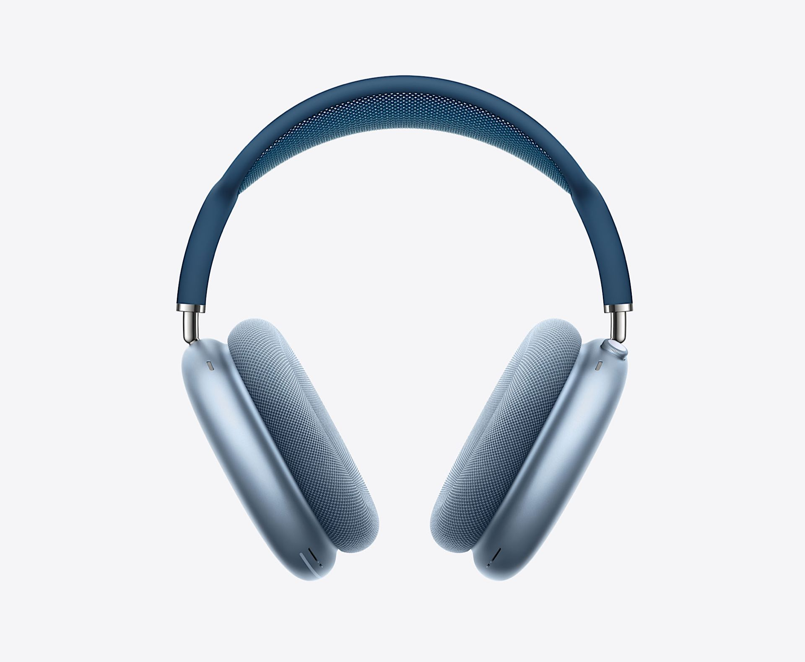
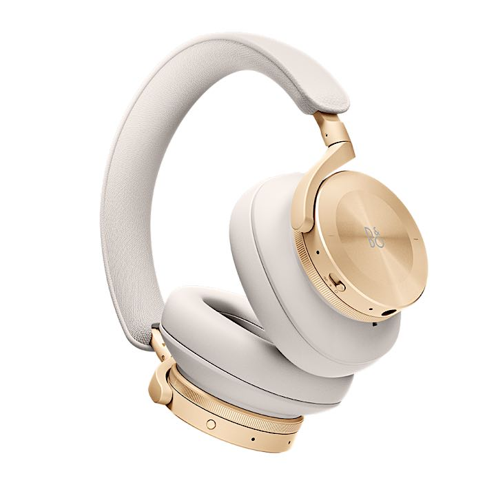

**629€** c'est la somme qu'il faudra débourser pour s'offrir les AirPods Pro Max d'Apple. Après le rachat de Beats, Apple s'est lancée depuis quelques années à la **conquête** du monde de l'audio. D'abord en continuant à **améliorer** les casques sous la marque Beats, ensuite en sortant des AirPods puis des HomePod pour rentrer tranquillement dans nos salons. Aujourd'hui, c'est au tour des casques audio ! 

Mais quand Apple décide de s'attaquer à un segment de marché, il ne faut pas s'attendre à des prix de marché ! Apple s'attaque toujours au **haut de gamme** d'abord. La marque le fait sans **concessions** afin de faire trembler ses concurrents. Là où Sony et Bose proposent des produits technologiques à la pointe, Apple va faire de même, mais en **mieux** et en plus **beaux**.

Entre nous, qui est-ce qui préfère le **design** des Sony wh-1000xm4 (nom commercial à chier d'ailleurs) ou celui des Bose QC35. Je pense que Bose a senti le coup venir il y a quelque temps déjà en proposant un produit proche techniquement des QC 35, mais au design qui donne envie les Bose 700.

Apple sort ses AirPods Pro Max et va éclater la concurrence, car tout sera maitrisé à la **perfection**. Il ne faut pas confondre les spécifications avec la réalité. Apple ne positionne pas son casque en casque de monitoring, la plupart des professionnels n'utiliseront jamais ce casque. En revanche, Apple veut donner du **plaisir** aux oreilles des personnes averties, qui écoutent de la musique à travers les services de streaming. Ils veulent arriver à rendre la musique vivante sans se prendre la tête des **spécifications** dont la plupart des novices se tapent (musique sans perte, etc.).

Le prix est-il justifié ? Le prix de marché représente le prix à partir duquel des acheteurs sont prêts à sortir leur carte de crédit, regardez par vous-même : il n'y a **plus de stock pour Noël** déjà !

Pourquoi le prix quand il s'agit d'Apple fait parler tous les sites de médias en ligne ? Quand je regarde une marque comme [Bang & Olufsen](https://www.bang-olufsen.com/fr/casques/beoplay-h95?variant=beoplay-h95-black) qui ont dans leur catalogue une paire de casques comparable aux AirPods Pro Max à 800€, finalement le prix Apple ne me choque pas. 

Pour profiter d'un son comparable aux écouteurs Sony ou Bose il faudra se tourner vers la marque Beats, point, pour le haut de gamme et des produits qui ne sont pas en **plastique** c’est chez Apple, mais le prix est à la hauteur des ambitions de la marque. 