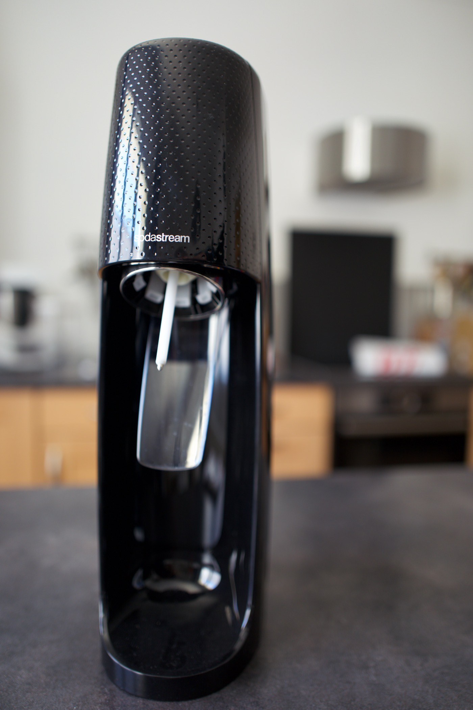
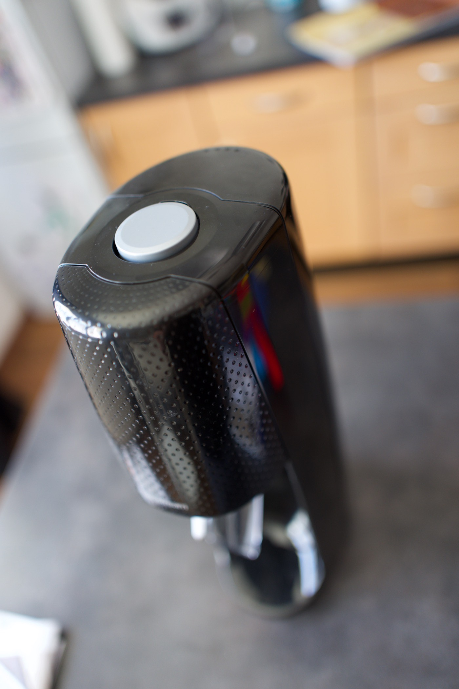
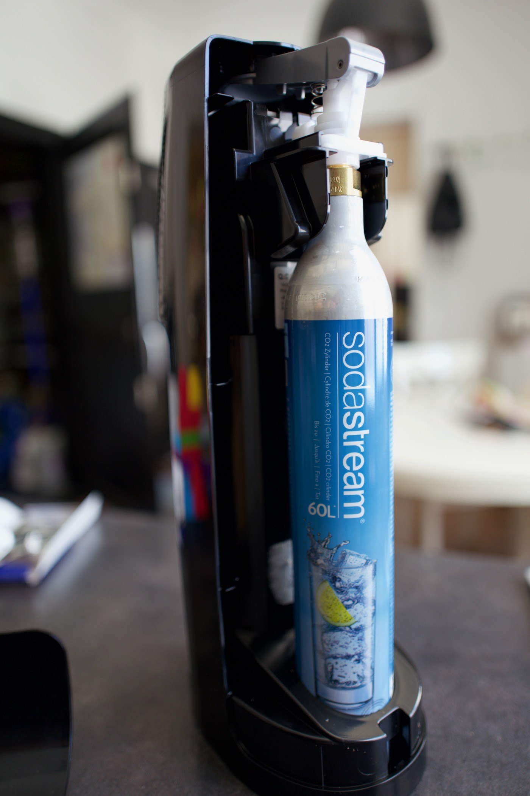

Si vous êtes un amateur d’eau pétillante comme moi vous avez dû vous apercevoir de la quantité de bouteilles en plastique sacrifiées sur l’autel de votre hydratation. 
C'est presque un pack de 6 bouteilles qui peut s'échapper à la poubelle toutes les semaines. J'espère d'ailleurs que vous pensez au recyclage et que vous ne jetez pas ces bouteilles dans le mauvais container. 

## Le zéro déchet dans l’air du temps
Si on veut tendre vers du zéro déchet ou dans un souci d'économie on peut avoir envie de passer sur une machine pour se fabriquer sa propre eau pétillante. 
Il existe à ma grande surprise un certain nombre de marques sur le marché. Je pensais naïvement que Sodastream était les pionniers. Malheureusement avec des sites de promotions, des sites de merde qui polluent internet avec de faux tests ou faux avis pour que vous passiez par leur lien d'affiliation difficile de s'y retrouver. 

Je vous donne ici 👈 mon avis le plus impartial possible, car **sans affiliation aucune**. 

J’ai choisi la machine [la plus simple](https://www.boulanger.com/ref/1125818) des différentes gammes. C'est une machine qui fonctionne sans électricité ça c'est un point crucial pour moi. En effet, je ne conçois pas une machine électrique ⚡️ pour simplement mettre trois coups de gaz dans une bouteille. Le principal avantage c'est que vous pouvez la placer dans n'importe quel *placard*, le second c'est qu'elle *durera* peut-être plus longtemps que le modèle électrique. 

## Du gaz encore du gaz ⛽️ !
Donc il faudra une fois la recharge de co2 placée appuyer trois fois ou plus selon vos goûts en nombre de bulles sur le seul bouton de l’appareil. Personnellement j'appuie entre trois et quatre fois, plutôt trois au début où la bouteille de gaz est pleine puis un ou deux de plus vers la fin. Vous ne tombez pas en rade d'un coup, la pression est moindre ce qui vous laisse le temps de planifier un aller retour chez Darty ou Boulanger pour échanger votre recharge. Oui la recharge ne se jette pas ! Vous la ramenez et vous payez juste la différence avec le prix de la nouvelle à savoir 12.99€. 

Mais combien dure une recharge ? J'ai compté environ 65 bouteilles. Sachant que c'est des bouteilles de 0.85l et non 1 litre cela fait 55 litres soit 5 litres de moins qu'annoncé. Bien entendu cela dépend de la quantité de gaz que vous allez mettre dans vos bouteilles. 

## Et ça vaut le coût 💵 ?
J'ai fait le calcul de rentabilité par rapport à une bouteille de Perrier à 58 centimes l'unité, vous rentabilisez la machine au bout de la troisième recharge. À partir de la troisième recharge de gaz, le prix 🏷 de la bouteille gazéifiée maison revient à 40 centimes environ. 

Bref vous n’allez pas forcément faire ce changement pour l’argent 💰 , en effet les bouteilles de Perrier tombe régulièrement à moins de 40 centimes d’euro la bouteille en promotion. En revanche, vous allez faire faire des économies à la collectivité, car vous enverrez moins de déchets inutiles en recyclage. Il ne serait pas étonnant de voir les bouteilles en plastique prendre une augmentation de prix dans les prochaines années avec [l’augmentation votée sur les produits en plastiques](https://www.bfmtv.com/economie/taxe-europeenne-sur-le-plastique-non-recycle-qui-va-payer_AV-202007230040.html) justement. 

Ne plus acheter ses packs au supermarché c’est aussi faire ses courses plus rapidement, moins de temps pour charger moins de temps pour décharger !

## Un défaut 🤐 ?
En parlant de plastique j’ai un problème avec ma version de Sodastream, cette toute la machine est faite de plastique ce qui ne rassure pas sur sa longévité, mais la carafe est-elle aussi en plastique ! Seul le modèle [Crystal](https://www.boulanger.com/ref/1145192) possède une carafe en verre et je ne peux que vous conseiller, à mon avis c’est le seul modèle que la marque devrait commercialiser. Alors oui il faudrait re calculer le seuil de rentabilité, mais je préfère qu’il soit de quatre recharges au lieu de trois, mais ne pas me bouffer du plastique à chaque verre d’eau ! Elle possède néanmoins plusieurs défauts, une bouteille 🍶 qui se visse moins bien sur la machine, et une réserve en eau 🚰 moindre 0,6 au lieu de 0,8 litre !