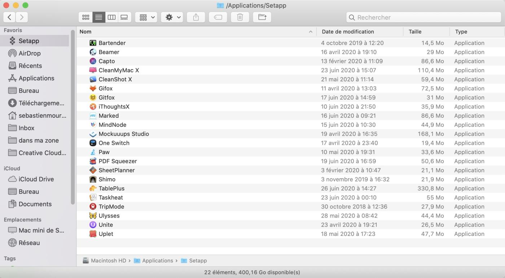
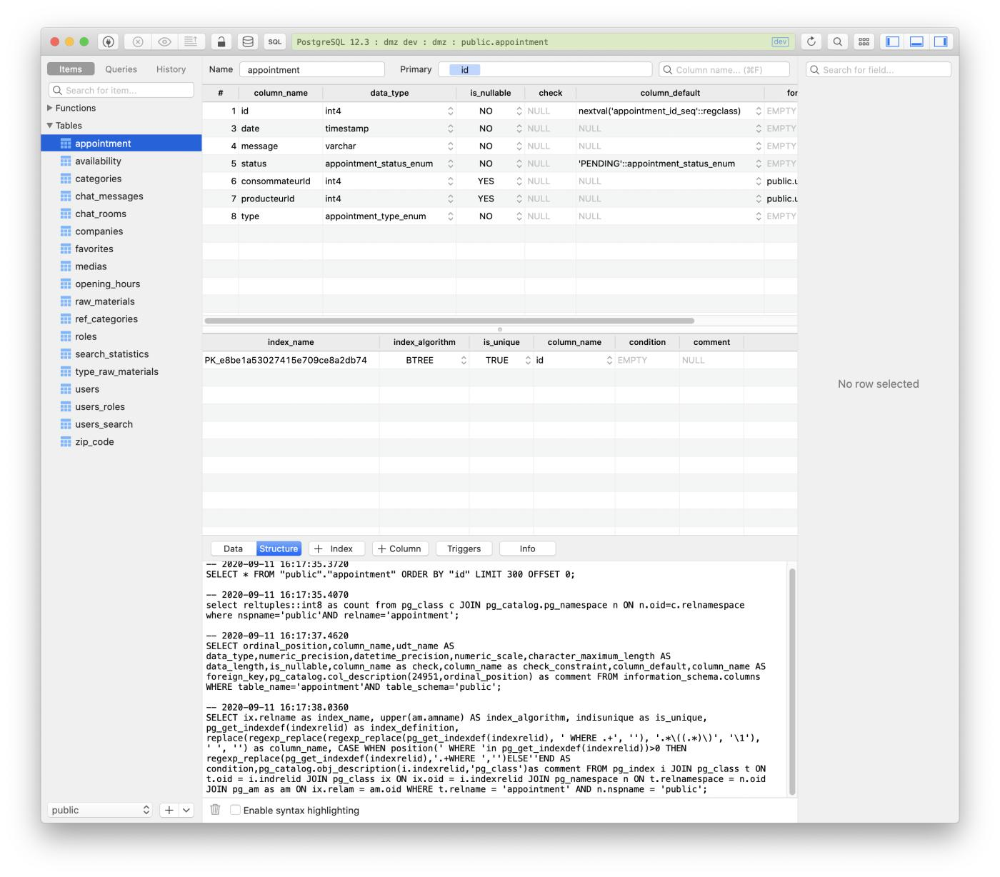

## Présentation de Setapp
Setapp est le Netflix des applications, c’est-à-dire que vous ne possédez plus vos applications, mais vous les louez. Le forfait a augmenté puisqu’il faut débourser 10 € par mois pour accéder au catalogue et pour ce prix vous ne pouvez l’utiliser que sur un poste. 

L’application est bien réalisée et vous permet de naviguer dans le catalogue de manière élégante. Chaque logiciel est plutôt bien mis en valeur et vous trouvez des fois une vidéo de présentation. Vous pouvez également cliquer sur le lien du site qui développe le logiciel pour avoir plus de détails sur son utilisation.

Les applications sont virtuellement toutes accessibles depuis Spotlight, je dis virtuellement, car celles qui ne sont pas installées sont présentes lors de la recherche. Il suffit de sélectionner une application non installée dans Spotlight pour lancer son installation, c’est très pratique et Apple avec son App Store pourrait s’en inspirer.

Les applications sont installées dans un répertoire propre à Setapp afin d’y accéder plus facilement. Vous pouvez les supprimer tout aussi rapidement. 
Elles se mettent à jour automatiquement comme pour l’Appstore c’est un bon point qui permet de ne pas s’en soucier. 

## Mon cas particulier

### Mes applications préférées de SetApp
J’utilise Ulysses pour rédiger à peu près tout le contenu des sites web en Markdown cela représente un cout de 30 €/an en offre spéciale.

J’aime beaucoup Bartender qui coute 15 € à l’achat et permet de garder une barre des taches rangée.

Mind node est un logiciel de MindMap que j’utilise plus depuis qu’il est passé à l’abonnement au prix de 22 €/an.

À la place de Mind Node j’utilise Ithoughtx qui à l’avantage d’être disponible sur toutes les plateformes au cout de 50 € pour Mac.

Enfin il me faut pour mon travail un logiciel de gestion de BDD, le plus cher disponible sur SetApp est SQLstudio Pro lifetime qui coute 220 €.

TablePlus, un super client de base de données.

iStat me permet de surveiller tout un tas de paramètres sur mon Mac, gestion des ventilateurs, personnalisation de l’affichage de la date et heure dans la barre des tâches, son prix est de 11€.

J’utilise pour maximiser l’autonomie de mon Mac le logiciel Endurance qui fait du bon travail pour empêcher l’ordinateur de passer en Turbo Boost sur la batterie, cet utilitaire est pas donné 20€.

Toujours dans les utilitaires j’aime beaucoup CleanShot qui permet de remplacer la gestion des captures d’écran sous Mac, il permet de faire des capture vidéo et GIF c’est un excellent logiciel comptez 30€.

### Analyse des prix 💰
Quand on regarde de plus près les applications qui nécessitent un abonnement représentent un cout de 80€ par an (à la louche), le prix annuel d’un abonnement SetApp est de 120€. Il me faudrait donc trouver un logiciel qui me coute ces 40€ de différence.

SetApp est intéressant s’il vous permet de couvrir à minima le cout d’utilisation de logiciel en abonnement sur un an. Autrement dit, il me faudrait pour 120€ de location de logiciel par an pour rentabiliser SetApp.

Mais cette rentabilité n’est même pas assurée si un des logiciels disparaissait du package. Oui, car comme pour Netflix certains films disparaissent de la plateforme, il en est de même pour l’abonnement SetApp. 

J’ai remarqué que certaines applications ne voient pas la licence SetApp et elles me demandent de l’acheter, c’est notamment le cas avec [Gifox](https://gifox.io/).

## Cher en multipostes
Setapp est excessivement cher en multi postes. Je possède deux ordinateurs, mon épouse un il faudrait débourser rien que pour moi 20€ par mois ! Contrairement à l’App Store qui fait grincer des dents 🦷 avec leur taxe de 30% pour les développeurs, l’utilisation est liée au compte Apple. Si par exemple vous possédez comme moi deux ordinateurs, ils sont surement reliés chacun à votre même compte iCloud. Ainsi, vous ne payez pas deux fois vos logiciels. De la même façon, un logiciel acheté est partageable avec les membres de votre famille. 
SetApp ne fait pas pareil et facture pour chaque ordinateur 👩‍💻  physique que vous attachez à votre licence. Je trouve ça dommage, car je ne conçois pas payer pour chaque ordinateur que je possède, car seul moi les utilise. 

Certaines applications ont le pendant sur iOS pour en profiter malheureusement il faut se prendre un forfait à 2,50€ par mois en plus ! Oui, vous avez bien lu… Ça ramène l’abonnement à 12,50€ par mois pour un Mac et un appareil iOS je que je trouve vraiment inacceptable selon moi. 
Je ne vois pas pourquoi payer plus cher et au nombre de machines alors qu’une seule personne est censée utiliser un logiciel à la fois !

## Conclusion
Vous l’aurez compris, difficile de vous recommander ou non ce service, chacun y verra un intérêt ou non. 
Personnellement, je trouve le positionnement trop cher. Professionnellement, ce n’est pas dit, en effet un certain nombre de logiciels peuvent être grandement utiles (gestionnaire de base de données, logiciel de gestion de projet).

Bref, malgré un bon positionnement si vous êtes "acheteur" des plus gros logiciels, pour le reste je trouve l’abonnement à un prix 🏷  trop excessif en rapport à l’offre et la diversité des logiciels présents. 

L’idée est vraiment bonne, mais le point noir est qu’une licence est limitée à un poste d’utilisation et non à l’utilisateur ce qui me parait beaucoup plus logique. Imaginez une personne qui possède : un MacBook 💻 , un iMac 🖥 , un iPhone 📱  et un iPad, ce cas de figure ne me parait pas délirant. Pourtant ils devront s’acquitter d’un abonnement de 20€ par mois !

Je reprendrai peut-être l’abonnement le jour ils géreront leur licence à l’utilisateur et non 🙅‍♂️ au poste de travail.