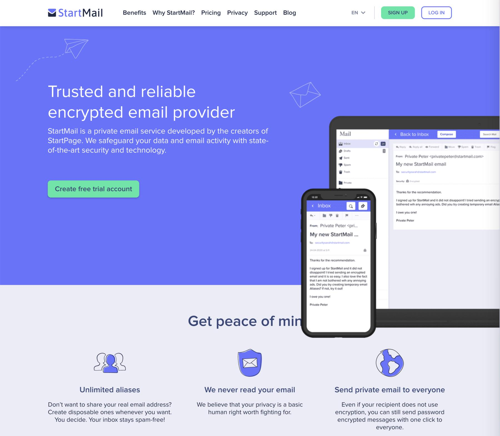
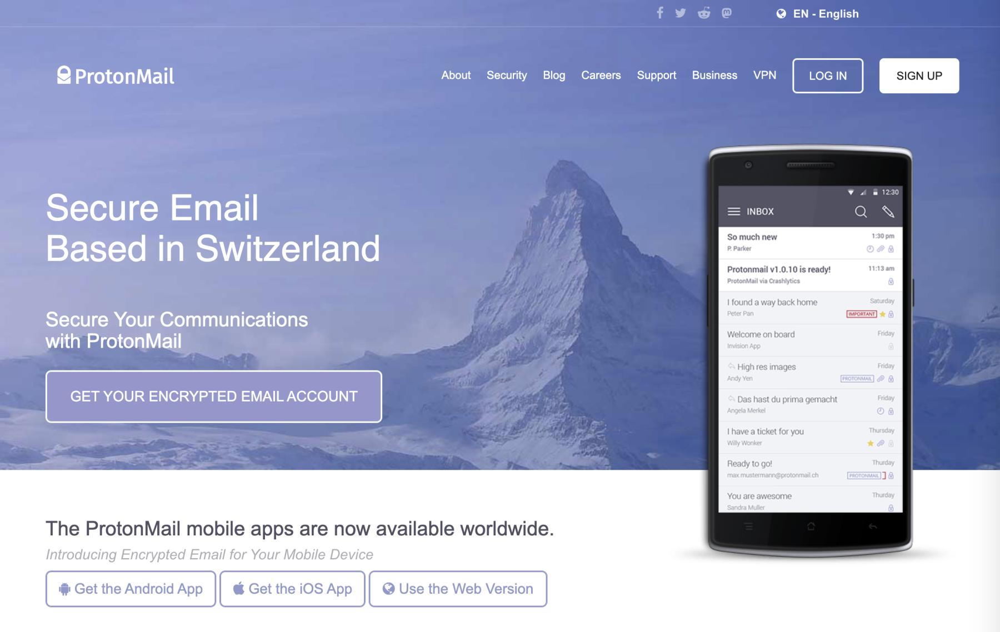
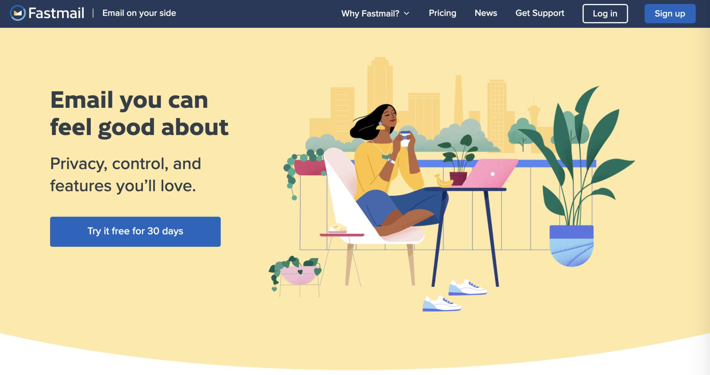
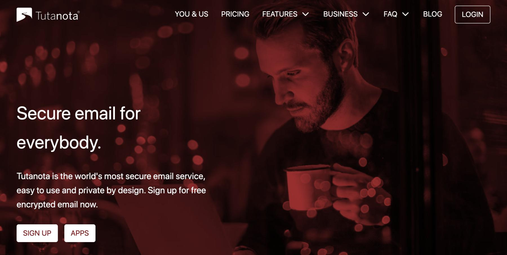
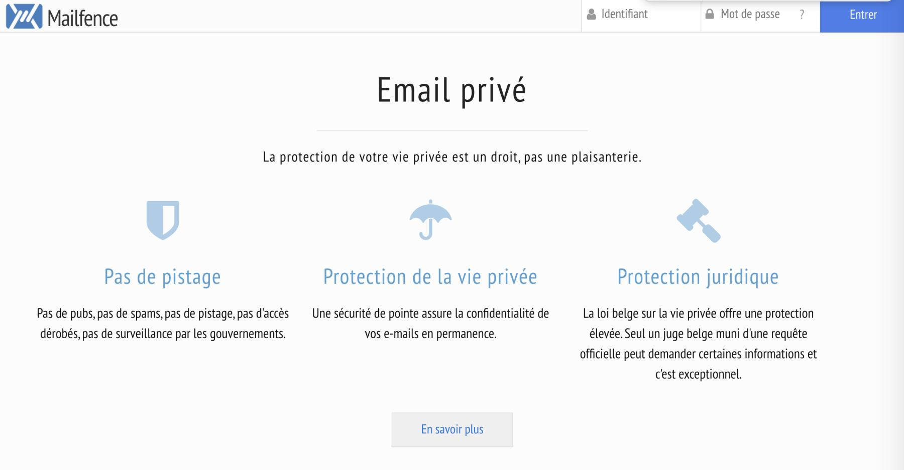
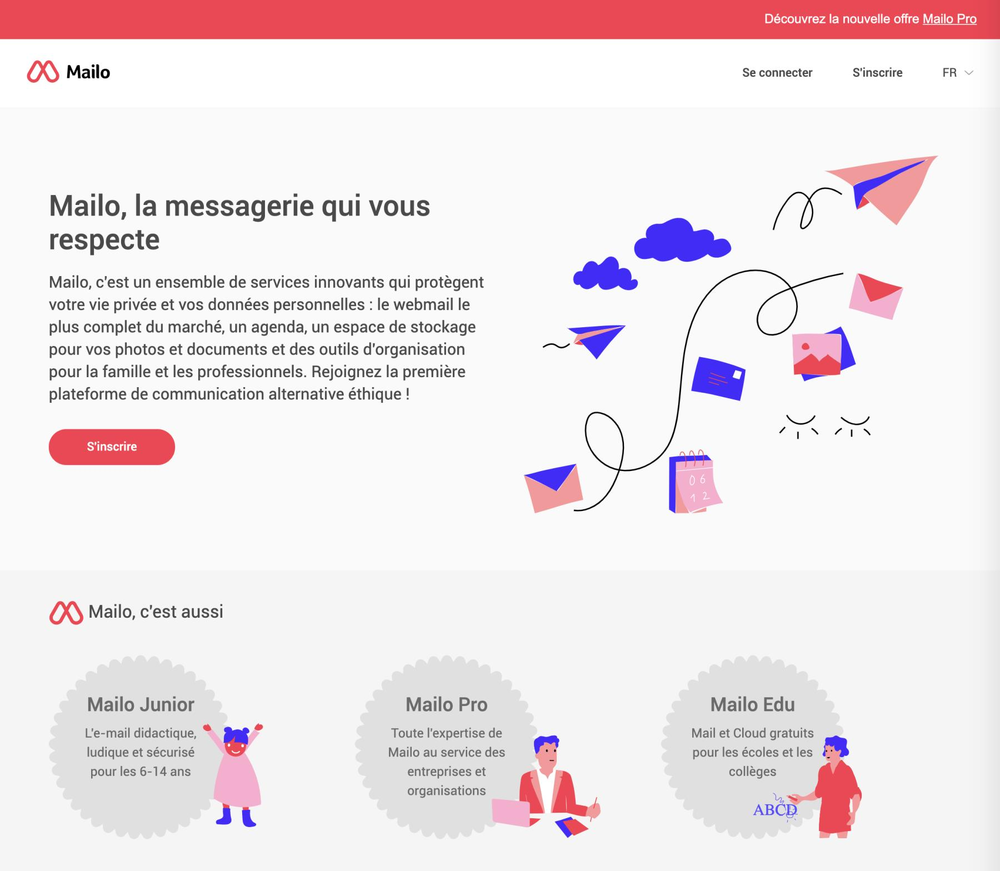

## La dégooglisation
Ne plus être traqué comme une bête par [Google](https://www.google.com) c’est ne plus avoir de compte [Google](https://www.google.com). Ça passe par la suppression de son compte Gmail. J’ai une adresse Gmail depuis 2006, c’était l’époque où les services Google s’ouvraient en mode "invitations".

Depuis quelques années j’ai un nom de domaine à mon nom et du coup une adresse mail. J’ai bêtement ajouté dans mon compte [Gmail](https://accounts.google.com) la récupération de ces emails 📧 pour tout centraliser. 

Maintenant je veux sortir de cette prison et passer à un webmail 📧 qui ne revendra pas mes données et surtout la possibilité de faire des recherches Google sans être connecté à leur compte. Je me suis mis à la recherche d’un service mail 📧 respectueux de la vie privée, je ne suis pas parano et j’accepte qu’un service puisse accéder à mes courriers comme pour une perquisition, donc je ne chercher pas forcément un chiffrage 🔐 de bout en bout. D’ailleurs si je dois avoir des conversations vraiment privées je passe par l’excellente messagerie [Signal](https://signal.org/fr/).

## Les besoins
Pour trouver le service mail idéal, il me faudrait quand même quelques fonctionnalités bien pratiques que Gmail me propose depuis plusieurs années :

- [Le Subaddressing ](https://tools.ietf.org/html/rfc5233#section-1 "Le Sub Adressing"), vous savez le signe plus "+" dans le mail 🥰 
- Les alias au moins 5
- Une interface web agréable
- Une application iOS 📲 digne de ce nom ?
- Une fonction Snooze (d’où l’application)
- Possibilité d’utiliser un client mail traditionnel
- Au moins 10 go voir plus d’espace disque

## Les prétendants 
Je ne vous liste pas ici tous les prétendants, seuls ceux qui ont attiré mon attention parce qu’ils proposent un ou plusieurs options intéressantes. Si vous voulez "presque" tous les comparer, je vous conseille ce [site](https://pypo.eu/ "pypo") qui est très bien fait et vraiment complet. 

### StartMail
Un [service](https://www.startmail.com/en/) allemand 🇩🇪. Ce qui m’a attiré dans ce service c’est la possibilité de créer un alias à durée de vie limitée dans le temps afin de pouvoir le balancer sur des sites juste pour utiliser le service sans risquer d’être spammé par la suite. 
C’est la même société derrière [StartPage](https://startpage.com), moteur de recherche qui se nourrit exclusivement des résultats de Google sans les cookies 🍪.

Avantages :
- Les alias à durée de vie limitée, sympa pour une inscription à un site poubelle, vous savez ces fameux livres blancs 😂 
Inconvénients :
- Cher, comptez 60$ par an pour seulement 10go d’espace

### ProtonMail
Comment ne pas parler de lui, c’est ce [service](https://protonmail.com "Visitez ProtonMail") qui revient sur tous les blogs. Je ne sais pas d’où vient ça notoriété (pas de son interface utilisateur en tout cas) mais toujours utile qu’en matière de confidentialité il est bien placé.

Avantages :
- serveurs en Suisse 🇨🇭 
- très bonne confidentialité 
- pas de compatibilité avec les clients mails traditionnels sur mobile et il faut passer par un "bridge" pour le client Desktop

Inconvénients :
- seulement 5go dans l’offre à 48€ par an
- obliger d’utiliser leur application mobile, car pas de bridge pour la récupération de mail dans Apple Mail sur iOS
- l’interface v3 est vraiment moche (la v4 est en beta à l’heure où j’écris ces lignes)
- pas de fonction snooze peut-être dans la v4

### FastMail
Un super [service](https://www.fastmail.com), vraiment complet si vous venez de Gmail vous ne serez pas dépaysé, en plus vous pouvez le tester dans sa version complète pour une durée de 30 jours et cela gratuitement. 
Personnellement j’ai vraiment accroché à ce service australien 🇦🇺.
 

Avantages :
- Interface qui se rapproche le plus de Gmail et les fonctionnalités aussi (snooze compris ! 👍) 
- Application iOS très bien faite
Inconvénients :
- Basé en Australie 🇦🇺 

### Tutanota
Celui là je ne le connaissais pas, c’est un [service](https://tutanota.com) allemand 🇩🇪. Il n’est pas cher dans sa version de base 1€ par mois. Aussi bon en confidentialité que Protonmail.

Avantages :
- Intégration de [formulaire de contact sur site web sécurisé](https://tutanota.com/secure-connect/)
- Interface très (trop) simple
Inconvénients :
- Pas de compatibilité avec les clients mails traditionnels
- Uniquement 10go pour la version à 48€ par an
- Manque de fonctionnalités (snooze, ajout de filtre directement depuis le mail)

### MailFence
Un service belge 🇧🇪 ! Je me suis arrêté à la création de compte depuis mon téléphone iOS ça a planté donc ça m’a énervé et je suis pas allé plus loin…
[https://mailfence.com/#plans](https://mailfence.com/#plans)

Avantages :

Inconvénients :
- Un service trop cher dans sa version 20go d’espace, comptez 7,50 € par mois.

### Mailo
Le petit [frenchie](https://www.mailo.com) de la liste 🇫🇷. 

Avantages :
- Gestion de compte familiale
- Prix défiant toute concurrence, je le recommande à quiconque a besoin d’un mail, fuyez Gmail et prenez Mailo
- Beaucoup (trop?) de fonctionnalités
Inconvénients :
- Interface trop brouillonne 
- Pas de signature DKIM
- Une application iOS à 🤢 
- Pas possible d’essayer le compte premium sans payer une année complète (soit 12€)

## L’heure 🕰 du choix
Et le vainqueur n’est aucun des services cités 😂. 

J’ai bien eu une attirance pour [Fastmail](https://www.fastmail.com), l’application et l’interface web sont vraiment top, les fonctionnalités, dont le snooze sont au rendez-vous. Je conseille vivement au "geek" qui ne veut pas trop se prendre la tête avec "le service est hébergé chez les méchants" d’y jeter un oeil. 
L’interface est top comme je le disais. Les fonctionnalités, à part le cryptage de bout en bout, en font un service mail complet. Le prix est plutôt bien placé, moins de 50 euros l’année, personnellement surtout pour un seul compte je ne suis pas près de mettre plus. À ce prix il faut ajouter celui du nom de domaine, le compte pour le conjoint, les enfants, ça devient vite cher 💰.

J’aurais aimé testé [Mailo](https://www.mailo.com), car il ne manque pas beaucoup pour que le service soit vraiment bon, il y a une tonne de bonnes idées et en plus c’est un service français 🇫🇷. Malheureusement, pas moyen de tester avec mon nom de domaine perso sans prendre l’abonnement à l’année.
En tout cas, je recommande ce service à tout le monde ! Ce devrait être le choix par défaut et je dirai même qu’on devrait créer un compte à nos enfants sur ce service plutôt que de les laisser en créer un sur un service qui exploitera leurs données personnelles à des fins de manipulations commerciales.

Fin du suspens, j’ai pris l’offre [OVH Pro](https://www.ovh.com/fr/emails/email-pro/ "E-mail pro - OVHcloud - OVH.comwww.ovh.com › emails › email-pro") mais qui est finalement quasi équivalente à celle intégrée de base à l’achat d’un nom de domaine chez [Gandi](https://www.gandi.net/en). J’ai 10 go d’espace, que je peux monter à 50. Je paie 24€ à l’année nom de domaine compris ! Soit environ, 14€ pour le service mail. 
L’interface est assez austère elle ressemble à celle de Outlook mais les fonctionnalités de bases sont là notamment la possibilité de créer un nombre d’alias illimités ainsi que le Subaddressing. Je peux également créer des règles sur le courrier (si tu contiens xx dans le nom alors mets dans le dossier).

## Conclusion
J’ai pour une somme assez modique pu profiter d’un compte mail avec mon propre nom de domaine. La configuration est à la portée de tout le monde, l’interface de OVH ou Gandi est plutôt adaptée à tout le monde. En somme si vous voulez avoir le contrôle total sur tout, je vous conseille de passer par le mail fourni avec votre fournisseur de nom de domaine. 

Je suis curieux de voir l’avenir de la boite mail française Mailo et j’aimerais vraiment qu’il y ait plus d’incitation de la part de notre gouvernement pour nous accompagner à la création d’une boute mail non géré à des fins publicitaires. Surtout que maintenant vous êtes tous obligés de déclarer vos impôts en ligne et donc d’avoir une adresse mail.

Si vous avez bien tout suivi, vous vous demandez comment je gère la fonction "snooze" qui est dans ma wishlist depuis le départ ? J’utilise le client mail Spark (bientôt disponible sur Windows), je le trouve vraiment agréable, je ne pense pas utiliser un jour la version payante donc c’est au risque qu’il disparaisse. Auquel cas je basculerai sur un client mail classique et oui, car je suis libre dans cette configuration d’utiliser le client mail de mon choix.

Je vous encourage fortement de créer à minima un nom de domaine à votre nom afin d’être libre d’utiliser le service mail de votre choix et de ne pas craindre la fermeture d’un service quel qu’il soit. 

Je vais pouvoir faire des recherches dans Google sans être connecté à ce maudit compte ! Oui, car les [autres moteurs de recherche je n’y arrive pas](%7B%7B%3C%20ref%20%222019-11-18-duckduckgo-je-n-y-arrive-pas-.md%22%20%3E%7D%7D%0A).

Je vous encourage à changer de navigateur également, voir [mon article ici](%7B%7B%3C%20ref%20%222020-04-29-aller-il-est-temps-de-quitter-le-navigateur-chrome-pour-brave-ou-firefox.md%22%20%3E%7D%7D%0A).