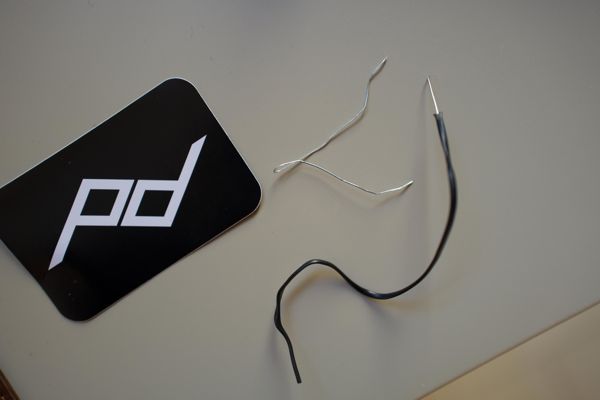
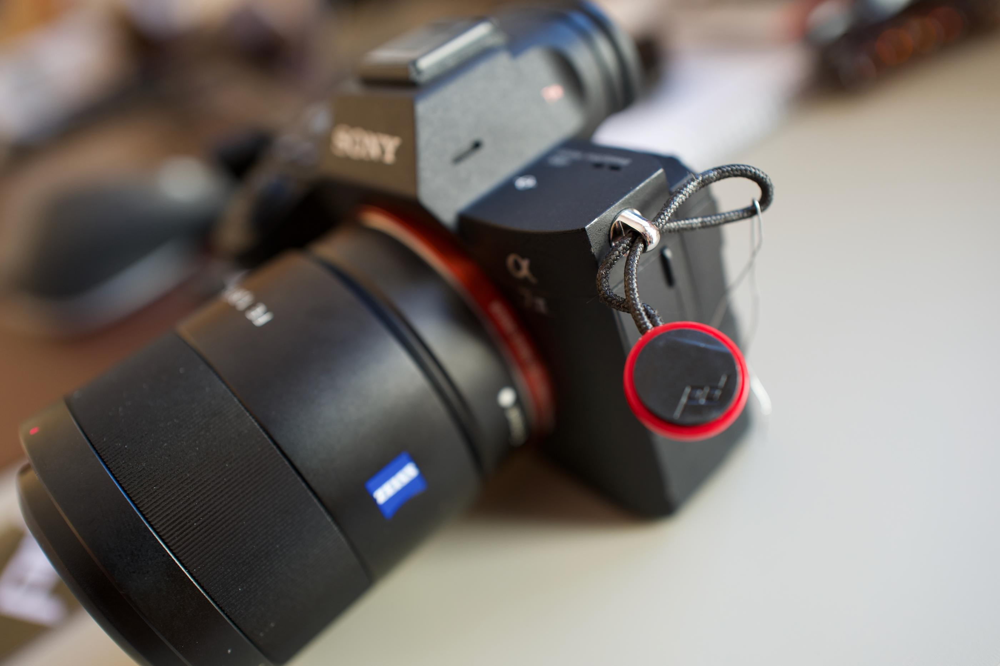

Vous avez reçu vos attaches [Peak Design](https://www.peakdesign.com/collections/straps/) et vous galérez 🤬 à les fixer sur votre Sony A7 ? Et bien vous n’êtes pas les seuls, j’ai une petite astuce pour passer les ancres facilement dans les boucles de votre appareil. Cela va vous éviter de remettre les adaptateurs qui font clic clic 🏌️‍♂️ à chaque fois que vous bougez votre appareil photo 📸. 

Commencez par récupérer les petits attaches en fer recouvertes de plastique, enlevez le plastique, vous allez ainsi avoir un joli fil de fer tout fin. 
Il ne reste plus qu’à l’utiliser pour tirer les ancres à l’intérieur de la boucle d’acier de votre appareil photo. Tirez le fil de fer avec une pince 😝, c’est plus simple.

Et voilà comment passer rapidement et simplement les ancres à l’intérieur des boucles de votre [appareil photo](https://tfada.fr/passage-dun-a7r-%C3%A0-un-leica-q/).