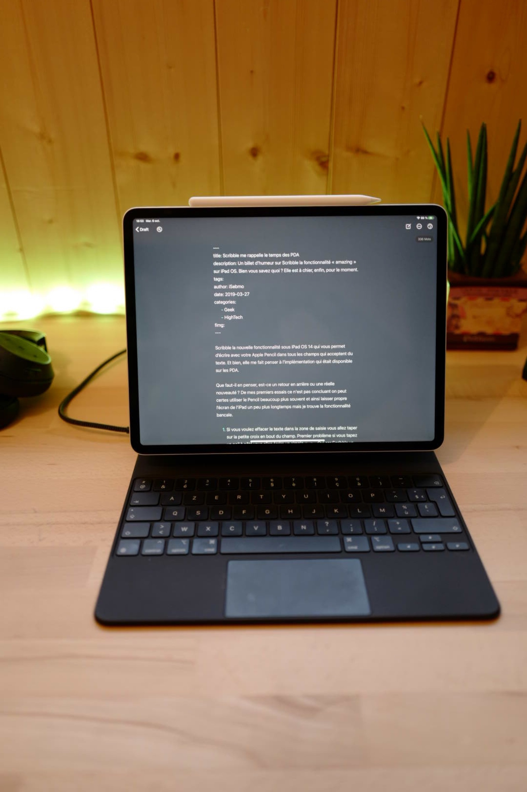
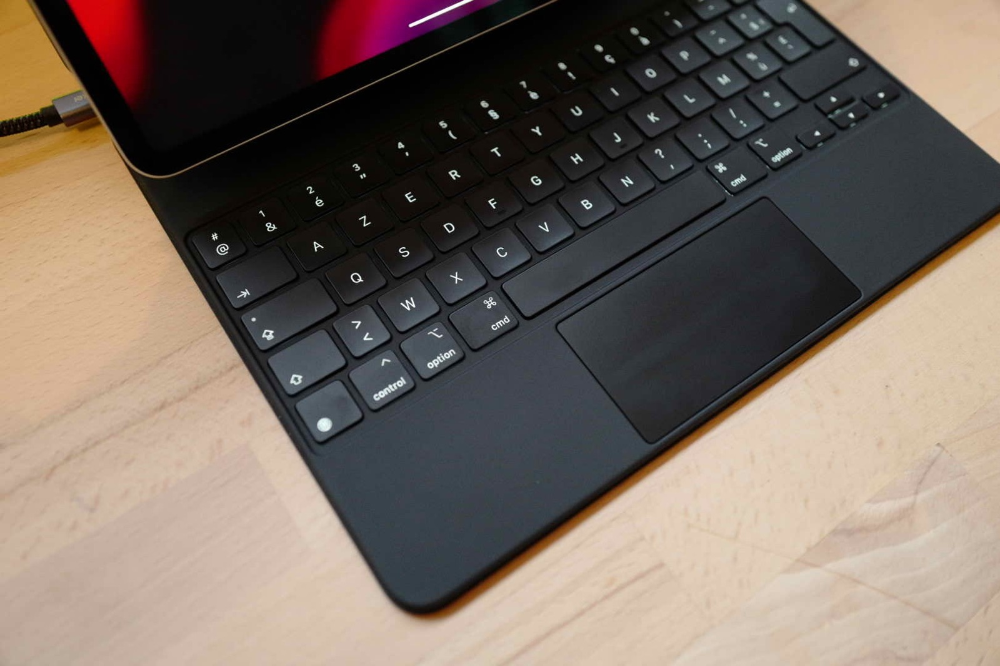
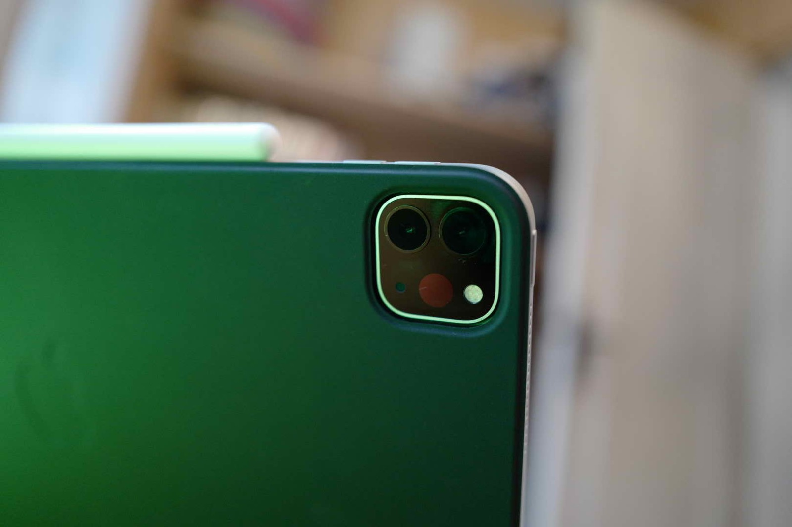
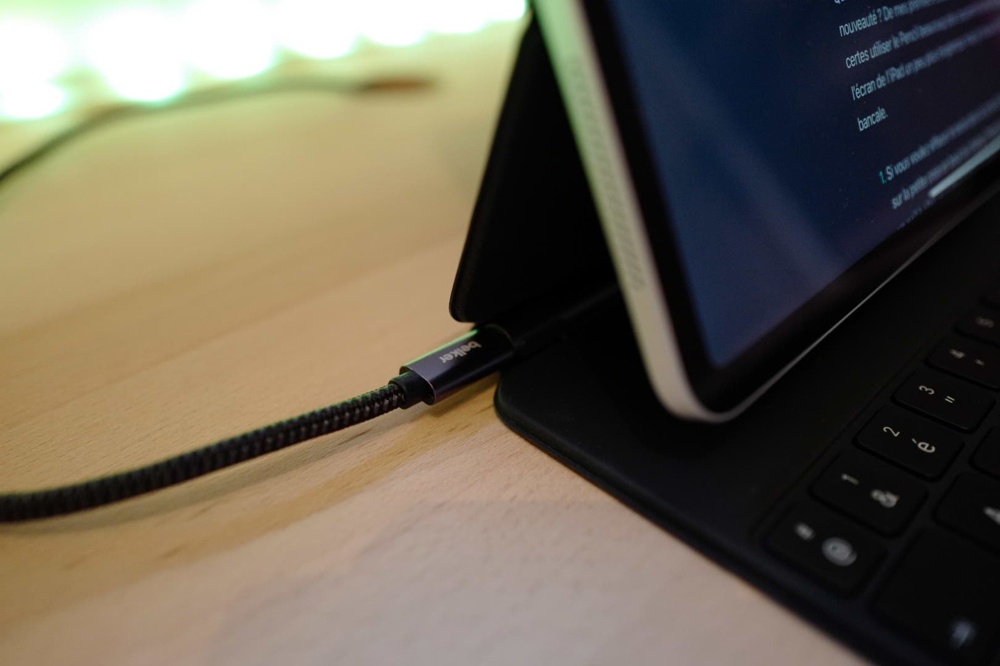
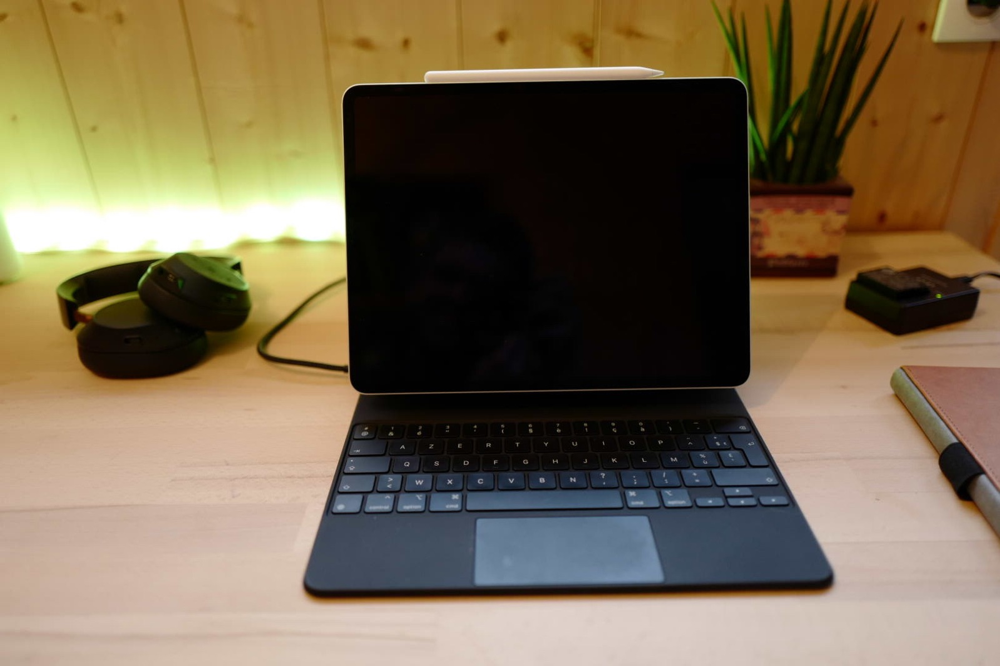
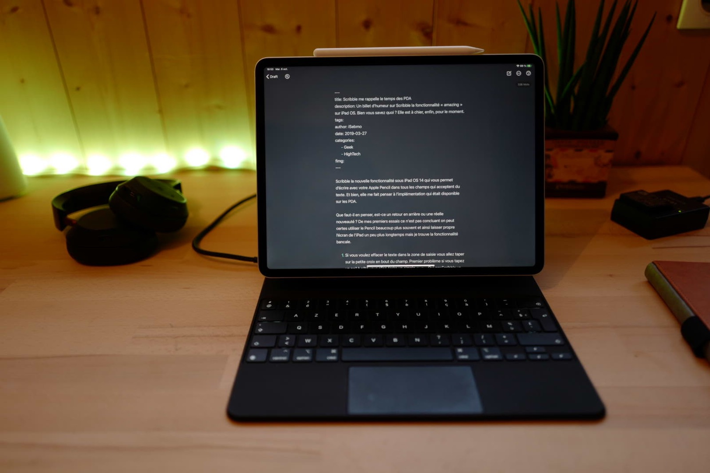

Bon croyez-le ou non mais j’ai repris un iPad 12,9 pouces… Oui je sais, je disais dans [cet article](https://tfada.fr/est-ce-quun-ipad-peut-remplacer-mon-ordinateur/) que la vente de ce dernier était définitive mais bon ya que les cons qui ne changent pas d’avis ? Attention ⚠️, en revanche je reste persuadé que l’iPad, même avec un OS dédié, ne peut toujours pas remplacer un Mac… Mais nous y reviendrons dans de futurs articles. 

Grand utilisateur du Smart Keyboard pour iPad j’ai utilisé celui pour petit iPad et celui de son ainé, j’ai vraiment **beaucoup aimé** 🥰. Pourtant je dois être le seul, car il n’a pas bonne presse. Personnellement je trouve le confort de frappe très bon, je n’ai jamais eu de **soucis** pour écrire de longs articles dessus, j’aimais bien sa légèreté également permettant d'emporter le clavier ⌨️ en même temps que l'iPad. 

Aujourd'hui j’ai troqué le Smart pour le Magic, avec ces noms on ne va plus s'y retrouver. Je pense sincèrement qu’Apple aurait pu **rajouter** un **trackpad** sur le **Smart** et je pense que j’aurai pris ce modèle à la place du Magic, mais bon soit.

## Des touches qui ne s’échappent pas 🚴‍♀️
L’absence de touche ESC, je ne sais pas à quoi pense Apple, en tout cas clairement l'iPad n’est pas destiné aux **développeurs** et c’est bien dommage quand on voit combien ils doivent leur rapporter. 
Bon cela dit à moins d’être dans un terminal vous n’en aurez pas besoin souvent. 

Autre détail que vous avez dû lire ailleurs les **touches numériques** sont proches de l’écran et en fonction de comment vous allez taper dessus, il est vrai que ça peut **gêner** (dans de très rares cas cela dit).

## Ergonomie générale 🤳
La **qualité** de fabrication est absolument **irréprochable**, normal à 400 balles le clavier. Heureusement d'ailleurs !
Cette fois, à la différence du Smart Keyboard on a droit au logo Apple dans le dos, ça nous fait une belle 🍏.

Pas de difficulté particulière pour ouvrir et fermer l'iPad, c’est ferme et tant mieux, l'iPad est sagement arrimé par ses puissants aimants 🧲.
Le temps de l’ouvrir et **Face ID** vous a reconnu, j’ose même pas imaginé le manque sur le nouvel iPad Air avec Touch ID (tu ouvres l'iPad, tu appuies sur le Touch ID, aussi chiant que sur Mac).

Le **gris** c’est **triste** mais on pourra se consoler en se disant que le clavier est rétro **compatible** avec la version 2018 !

**L’ergonomie** aurait pu être **améliorée** avec l’ajout de touches fonctions pour accéder rapidement aux changements de pistes, baisser le volume ou changer la luminosité 🔆... À moins de faire un écran plus grand je ne vois pas comment les ingénieurs auraient pu faire rentrer ces touches. 
Le vrai manque c’est iPad OS, **impossibilité** de mettre en place des **raccourcis** claviers pour des fonctionnalités dans les applications. Si je veux re programmer les raccourcis pour l’envoi de mail dans Apple Mail ce n’est pas possible... Pourtant c’est une fonctionnalité qui existe depuis bien longtemps. 

## Ça charge 🔋
Je suis fan de la prise USB-C sur le clavier, on se retrouve avec une prise des deux côtés et ça c’est intelligent. On peut en fonction de l’endroit où on se trouve **brancher** l'iPad sur la prise la plus proche et la plus adaptée. 
J’adore la possibilité de prendre la tablette tout en laissant le clavier branché, ainsi dès que je la repose, elle se **recharge**, presque aussi efficace que le chargement par induction 😁.

Que dire des **touches rétro-éclairées** et le clavier alimenté par l'iPad un sans-faute de ce côté. 

## Un trackpad qui clique 😤
Un petit grief sur le trackpad, son étroitesse ne me dérange pas en revanche le **bruit** du clic nettement plus. Vraiment, la première chose que j’ai faite c’est d’activer le clic au toucher, pourtant je n’aime pas car j’ai beaucoup de « faux » clic (sur l’application Notion c’est une **horreur**).
Non vraiment je ne comprends pas comment c’est possible de faire des **touches silencieuses** et un **trackpad** aussi **bruyant** !

## Un tarif 🏷 au poids ⚖️ ?
Ah oui la chose qui fâche le prix, 400 balles le machin ! Bon j’ai réussi à l’avoir à 350 € chez Boulanger, mais quand même, le prix d’un iPad !

Le poids, il pèse plus que l'iPad lui-même, parait qu’il faut ça pour compenser le poids de la bête sur les **genoux** si on ne veut pas le retrouver par terre ! Le poids d’un 💻 air paraît-il, toujours utile que je préfère un iPad 12 pouces et un MacBook Pro 13 pouces plutôt qu’un seul 16 pouces, surtout que je suis un vrai fan du **double** **écran** en mobilité grâce à **SideCar**. 
Ça **pèse**, mais comme je le disais plus haut ⬆️ la possibilité de laisser branché le clavier quand on veut utiliser que l'iPad en mode tablette est un vrai plus. Du coup je me retrouve plus souvent à utiliser l'iPad seul dans le canapé 🛋 que quand j’avais le Smart Keyboard.

## Une machine à écrire ✍️ de dingue 😝 
Ce clavier transforme l'iPad en machine à écrire de luxe, j’adore 👍. C’est vraiment **immersif** quand on commence à écrire dessus à la différence du Mac.

J’ai quand même beaucoup de griefs sur iPad OS, qui plus est depuis la dernière version, est-ce encore bien une priorité d’Apple de nous fournir un système digne de Mac OS ?

Finalement, l'iPad est à comparer à un Chromebook, certes de luxe, quoiqu’ils existent déjà. Je ne serai jamais aussi productif qu’avec un Mac, mais l'utilisation de ce clavier en duo avec le trackpad apporte à l'iPad une tout autre dimension dans son utilisation. 