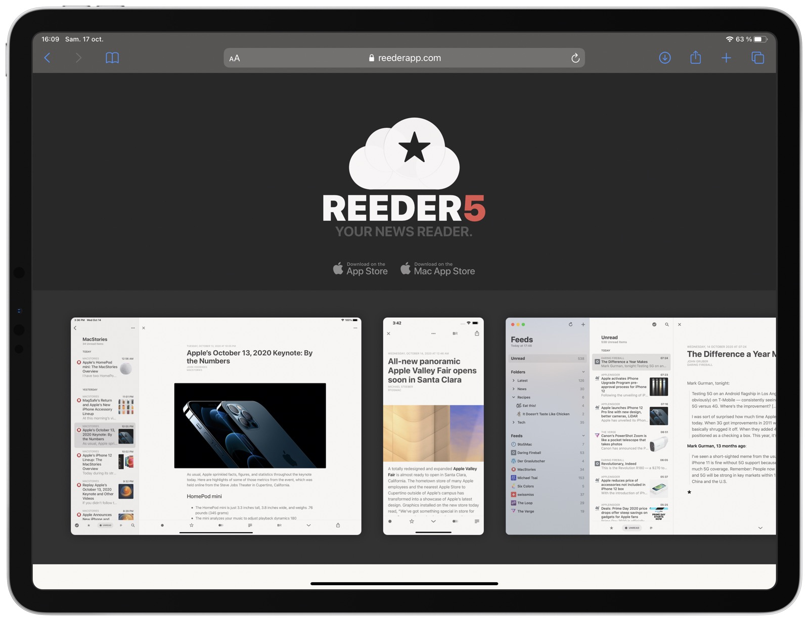
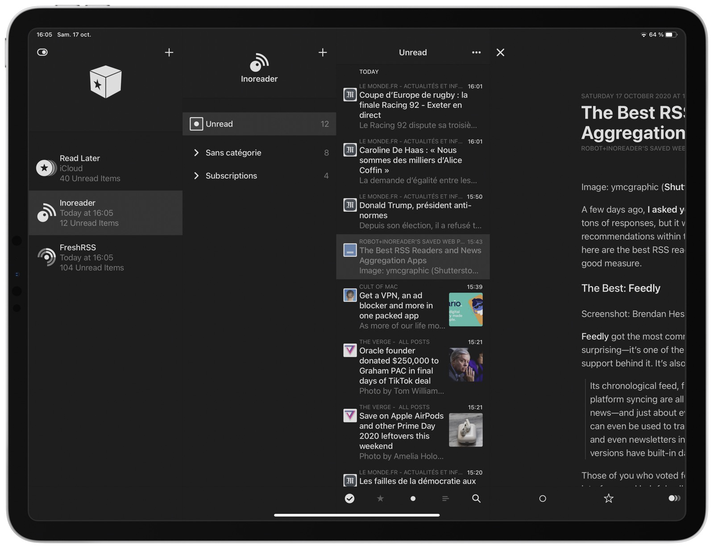

---
title: Reeder 5 est de sortie, les flux RSS sont libérés !
description: Reeder 5 vous permet de vous affranchir de services RSS externes et se synchronisera automatiquement avec vos différents appareils Apple. 
tags:
- rss

author: iSebmo
date: 2020-10-17
categories:
- applications

fimg: ""
--- 
Cela fait un moment que je me dis qu'il faut que je fasse un article sur Reeder ce super 👍 logiciel de gestion de flux rss. Avec la sortie de la version 5 je vais donc me lancer et arrêter de procrastiner !

J'avais fait un article sur [News Explorer](https://tfada.fr/lire-son-flux-rss-sans-d%C3%A9pendre-dun-service-web-avec-news-explorer/) qui vous permet de gérer vos flux RSS sans passer par un service tiers comme Feedly ou Feedbin par exemple. Eh bien sachez que [Reeder](https://reederapp.com) dans sa version 5 reprend les mêmes fonctionnalités afin de remplacer non seulement un service RSS, mais aussi un service de lecture différée comme Pocket. 
Ben entendu ce genre de fonctionnalités ne vous intéresseront que si vous consommez vos contenus sur des appareils Apple, car ces services reposent sur iCloud pour la synchronisation. 

Un service comme Feedly peut vous coûter environ 50 € par an et quasiment la même chose pour [Pocket](https://getpocket.com/) donc vous faites une économie de presque 100 € si vous utilisez Reeder. 

Je suis abonné au journal 📰 le monde 🌎 et je vous invite à vous y abonner aussi pour que la presse reste la plus indépendante possible, cela étant dit j'avais fait un [article](https://tfada.fr/lire-les-articles-premium-en-hors-ligne-avec-pocket/) pour accéder aux articles payants 💰 par l'intermédiaire de Pocket. Depuis j'ai abandonné ce service au profit de Reeder qui me permet d'accéder de la même manière à mes articles protégés par mot de passe 🕵️. C'est d'ailleurs plus rapide d'accéder à l'article directement sur le site depuis [Reeder](https://reederapp.com) que depuis [Pocket](https://getpocket.com/) (un clic de plus). 

Je pense acheter la dernière version de [Reeder](https://reederapp.com) puisque je possède toujours la version 4 et même si j’utilise un service auto hébergé pour mes flux rss ([Freshrss](https://freshrss.org/), je teste également [Inoreader](https://www.inoreader.com/) pour ses fonctionnalités bien avancées). Alors pourquoi payer pour la version 5 de Reeder si je ne vais pas utiliser la principale nouveauté me direz-vous ? Tout simplement pour soutenir 🥰 le développeur et jouer le jeu 🎰 si je ne veux pas qu'il passe à la mode des abonnements. 

Et vous, vous faites comment pour suivre vos flux d'actualités 🗞 ?