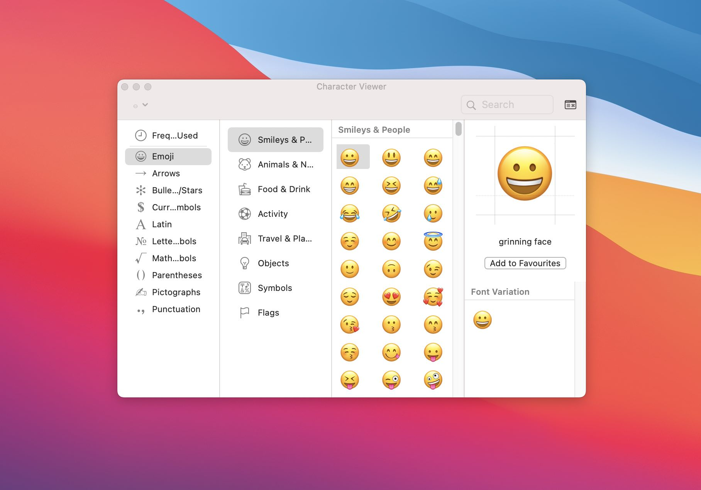
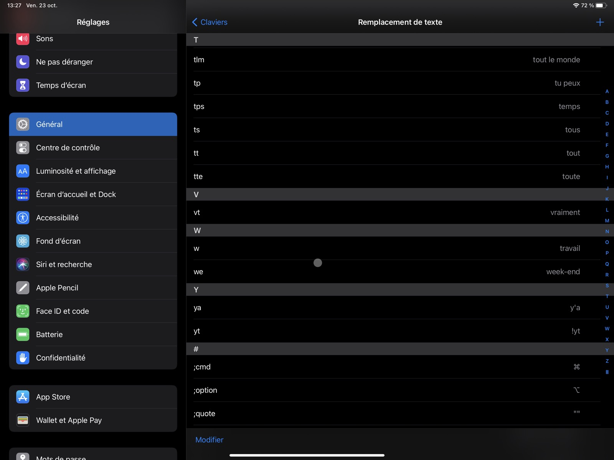

---
title: Vos caractères spéciaux ⌘ rapidement sous iOS
description: Comment profitez de caractères spéciaux rapidement et gratuitement sous iOS sans passer par une Application dédiée ?
tags:
- ios

author: iSebmo
date: 2020-11-13
categories:
- geek

fimg: ""
--- 
Si vous avez besoin de caractères spéciaux sous iOS c’est plutôt une plaie, car malgré le côté « pro » revendiqué par Apple, sur mon iPad impossible d’avoir accès à ce caractère ⌘ rapidement ! Les gars du marketing nous bassinent que l'iPad est le nouvel ordinateur c’est d'abord le passage obligatoire par le store qui les intéressent. 

Il existe bien une [application](https://apps.apple.com/fr/app/unichar-unicode-keyboard/id880811847) pour retrouver ce qui [est natif dans MacOS](https://tfada.fr/afficher-les-emojis-sous-mac/) à savoir une liste de caractères spéciaux, vous pouvez l’essayer elle est gratuite pour les principaux caractères.

Si vous n’avez besoin que de quelques caractères à disposition, pour ma part c’est le symbole ⌘ et ⌥, je vous donne une petite astuce gratuite. 
Vous allez utiliser la fonction de remplacement de texte native à iOS et MacOS. C’est une fonctionnalité peu connue, pourtant diablement efficace. Elle vous permet de spécifier une série de lettres qui sera remplacée par le texte de votre choix. 

Dans notre cas il vous suffit de copier le caractère ⌘ (ou celui de votre choix) puis d’y associer une chaîne de caractères qui déclenchera le remplacement. Ainsi, quand vous écrivez « ;cmd » cette chaine de caractères sera remplacée par ⌘. 

Donc maintenant à n’importe quel emplacement si je tape « ;cmd » le système me le remplace par ⌘ ! Pratique n'est-ce pas ?

Bien sûr vous pouvez, et je vous y encourage fortement, utiliser cette fonctionnalité pour stocker ce que vous écrivez le plus souvent ainsi vous gagnerez en rapidité et évitez les erreurs. Par exemple « @mail » pour vous aider à écrire tout simplement votre adresse mail. Certains l’utilisent pour remplacer par leur emojis préféré, cependant la Touch Bar du ⌨️ Mac 💻 est très forte pour ça 😂.