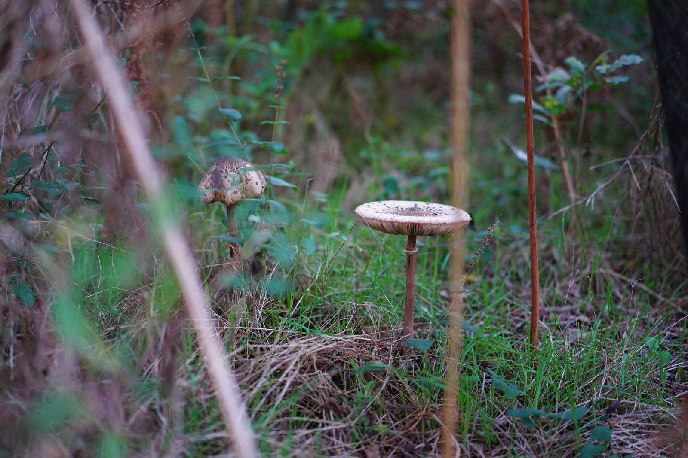
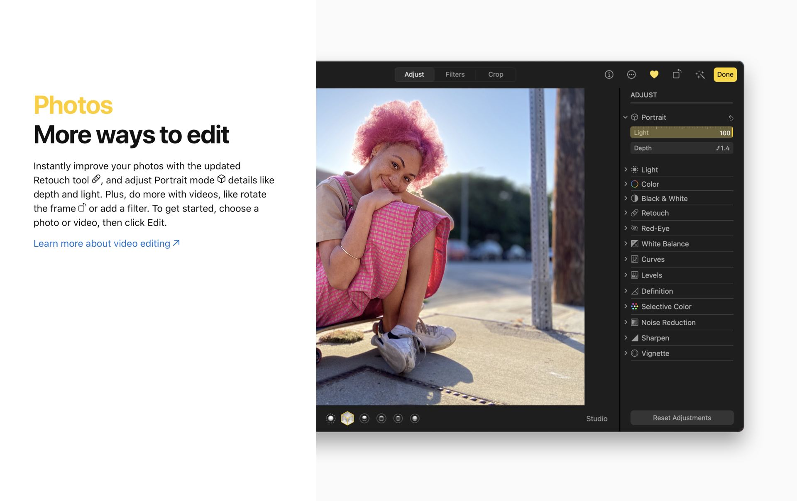

Le nouvel iPhone 12 est sorti et tous les fanboys se ruent dessus.
Comme chaque année la grande messe d'Apple a eu lieu et comme chaque année un « amazing » iPhone plus **beau** et plus **puissant** que tous les autres, est présenté. 

Au programme cette année une refonte du design, puisque nous avons le droit à une **refonte** tous les 3 ans maintenant. Une **amélioration** photo et c’est tout. C’est tout ? Oui, car le reste n’est que là pour cacher le grand vide ou la maturité, diront certains, la **maturité** des téléphones qui n’ont plus grand-chose à nous apporter, ou alors ils **cannibaliseraient** les ventes d’autres produits ?

## La photo pour les nuls 😒 
Le crédo d'Apple depuis quelques années, c’est la photo. Pas forcément le crédo réservé à Apple, mais en tout cas à défaut d’avoir de nouvelles idées 💡 ils misent tout dessus. Je ne vais pas cracher dans la soupe, c’est tant mieux, cela permet de démocratiser ce marché qui était jusque-là, il faut bien le dire, réservé à une niche. 

C’est vrai, qui est capable de donner un sens au mode P, V, M sans s'être intéressé un peu à son appareil photo ? 
Qui a pris le temps **d’organiser** ses photos, qui n’a jamais eu le **flegme** de récupérer ses photos sur sa **carte mémoire** pour les enregistrer sur son ordinateur ? 
Je pense que beaucoup d’entre nous se reconnaîtront. 

Est-ce que ça me gêne ? Pas du tout bien au contraire. Ce qui me **gêne** le plus, c’est plutôt **l’aveuglement** de certaines personnes devant ce vomi 🤮 du **marketing** qui vous pensez que vous serez le meilleur des photographes si vous possédez ce dernier joujou. C’est faire croire aux gens que leur photo pourront se mesurer à du travail de professionnels (je ne le suis pas). 

Avez-vous essayé **d’isoler** un petit objet avec un iPhone ? Le téléphone ne comprend pas ce que vous voulez faire, tant qu’il est prévu pour un effet particulier par exemple le mode portrait il peut faire des choses incroyables 😻, mais dès lors que vous voulez laisser libre cours à votre **imagination** si ça n’est pas prévu par Apple alors votre photo a de grande chance d’être **ratée**.

C’est sur ce point que je voudrai attirer votre attention, certes l'iPhone vous permet de faire de **jolies photos sans effort**, mais elles **ressembleront** pour beaucoup à celles du **voisin**. Donc avant de dire, je revends mon matériel photo, posez-vous les bonnes questions. Faites-vous de la photo pour faire de la photo ou bien cherchez-vous à faire des photos **créatives** qui sortent de la **masse**.

## Un mode portrait qui ne sera jamais parfait

En parlant du **mode portrait** regardez cette photo, elle a été tirée de la présentation de Big Sur. Sûrement faite à l’iPhone, le mode portrait y est affreux 😤, regardez les cheveux les zones de flou en premier plan sont abominables !

## Point and shoot

Si vous cherchez un téléphone pour **documenter** votre vie, prendre des photos sur le tas, alors effectivement ces avancées technologiques ont un sens. Ne tombez pas dans le piège du « pro » tel qu’Apple veut vous le faire concevoir. Un iPhone Pro **n’a rien de professionnel**, si on remplace « pro » par « deluxe » alors oui ça a plus de sens. 

Donc merci à Apple et Google d’avoir **simplifié**, la prise de photo, le partage, l’organisation et même le traitement. Je dis bien **traitement**, car le photographe en herbe lui fait du post-traitement.
Quand on y réfléchit bien, ces monstres de la tech n’ont pas seulement remplacé des appareils photos, ils ont remplacé le **workflow** complet du photographe. De la prise de photo jusqu’au partage, tout a été **automatisé** et **simplifié** à **l'extrême** pour le **commun** des **mortels**. 

Je termine sur cette note **positive**, car oui, la majorité des gens qui laissaient leur appareil photo au placard, depuis l’arrivée des photophone font énormément plus de photos et c’est tant mieux !

N'oubliez pas que si vous aimez la photo, **apprenez à vous servir d’un appareil** et faites lui faire ce que VOUS voulez et non pas ce qu’on a décidé qu’il fasse pour vous. 

## Une vidéo afin d'illustrer mes propos
