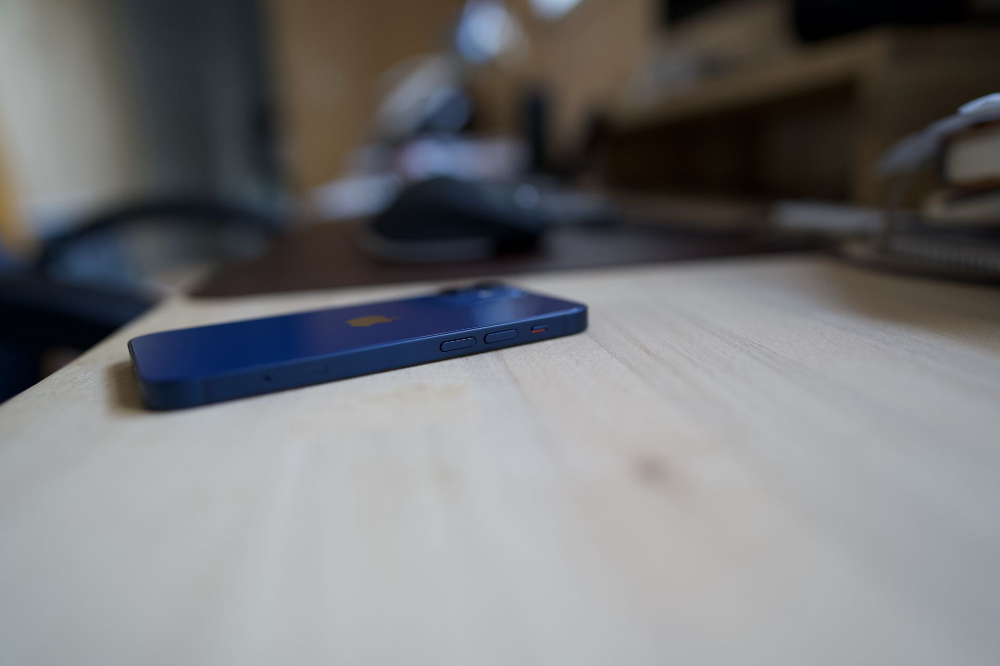
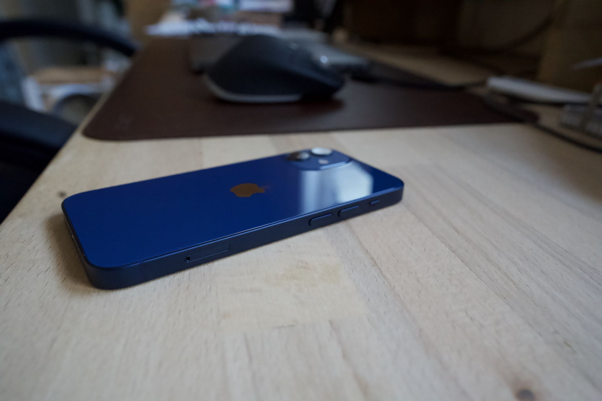
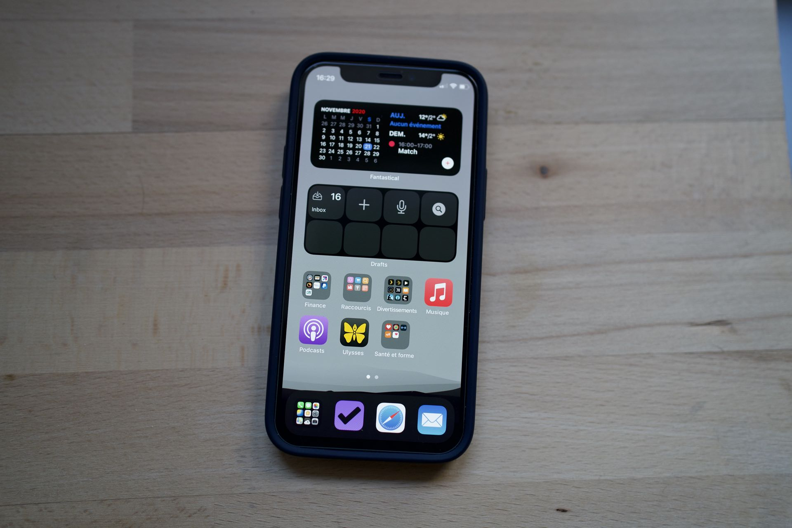
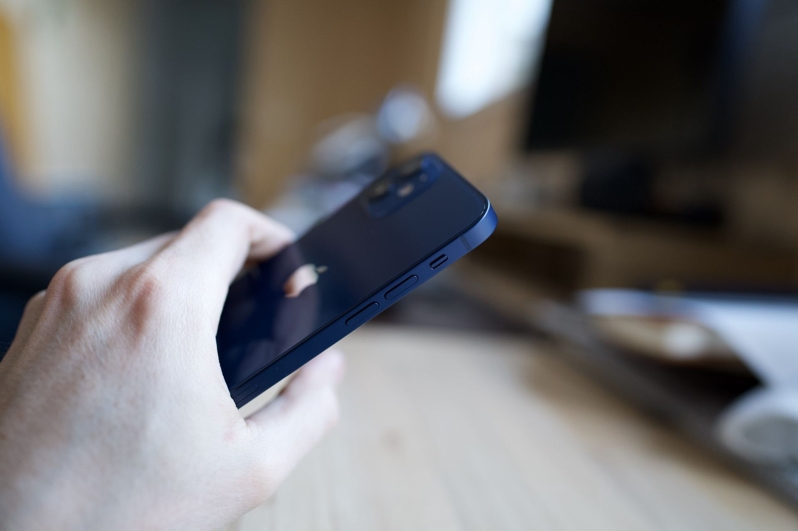
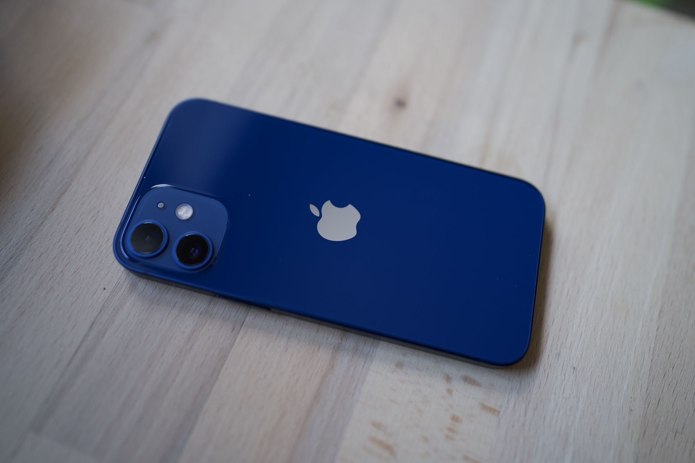
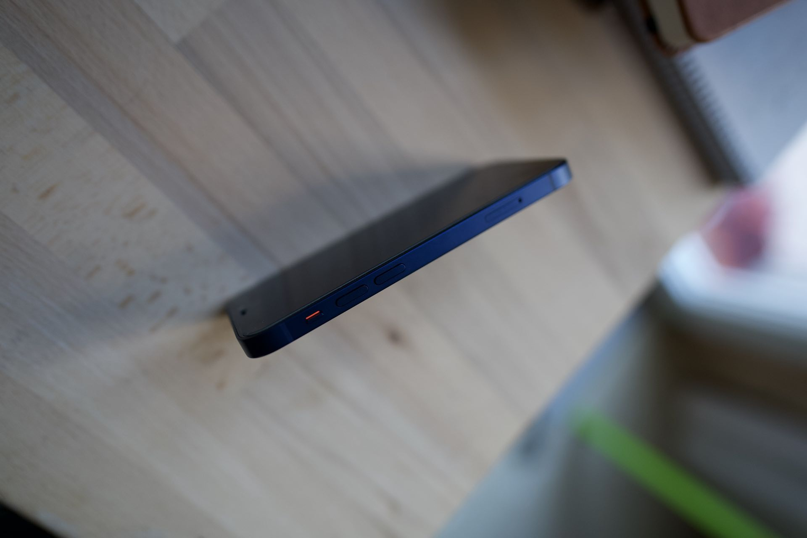

Comment ne pas avoir la chanson de Jacques Dutronc dans la tête quand on pense a cet iPhone mini 📱. 
Passage du X au mini et honnêtement ça fait plaisir de retrouver ce format. 

## Le design de l'iPhone 5
Le design de l'iPhone 5 était pour moi la référence, ce design revient à la mode pour Apple. Faut-il y voir le résultat du [limogeage de Jonathan Ive](https://www.lemonde.fr/economie/article/2019/06/28/apple-jonathan-ive-le-depart-d-un-heros-fatigue_5482584_3234.html) ? En tout cas c'est assez drôle de voir le cycle de la mode perpétue sur les iPhone quand on regarde le premier du nom puis l'iPhone X premier cycle et enfin iPhone 4 et iPhone 12 deuxième cycle. 

Alors cette depuis l'iPhone 5 la technologie a permis à l'écran d'occuper tout l'espace disponible et c'est super 👍 cela permet de continuer à utiliser l'iPhone à une seule main 🤚. J'adore ce format, faites vos courses et cochez ✅ vos listes avec un téléphone dans les mains et je vous assure que vous verrez l'intérêt d’un mini iPhone !

On attend à présent la petite évolution qui sera présentée comme une révolution quand l’encoche disparaîtra du haut de nos écrans. 

Seul regret depuis l'iPhone 5 le module photo dépasse. Pourtant sur ce mini et sa capacité de batterie 🔋 diminuée il eut été préférable d’augmenter l'épaisseur pour compenser cette perte d'autonomie... 

## L'autonomie de l'iPhone X
Comme je le disais je passe d'un iPhone X à un iPhone mini et je n'ai pas constaté de baisse d'autonomie. Je peux comprendre les craintes pour les personnes qui avaient un iPhone 11. 

Attention tout de même à ne pas utiliser le dual SIM j'ai remarqué qu'avec deux SIM dans la machine la perte d'autonomie était réelle en rapport à celle de l'iPhone X. 

Si vous avez un travail avec une prise toujours à disposition les craintes sur l'autonomie n'ont pas lieu d'être en revanche si vous utilisez votre téléphone très souvent et loin d'une prise de courant alors forcément ce n'est pas un modèle adapté pour vous. 

## Le module photo s'améliore 
Toujours en comparaison avec mon ancien iPhone X les photos sont plus détaillées et beaucoup moins traitée du moins quand la luminosité est suffisante. 

 

En basse luminosité je ne vois que très peu d'amélioration faut être honnête.

Le mode portrait comme je le disais dans un autre article est une catastrophe dès que le sujet est mouvant. Donc exit les photos en mode portrait de nos enfants en bas âges. L'association d’un objectif à grande ouverture à un capteur full frame a encore de beaux jours devant lui. 

## De la puissance en veux-tu 
Côté performance ⚡️ honnêtement je ne vois pas beaucoup la différence, je génère peut-être plus vite l’attestation de sortie en ces temps de confinement. 

Je ne suis pas un joueur de jeux vidéos, donc je ne peux pas faire de comparaison objective sur ce terrain entre l'iPhone X et ce petit iPhone. 

## Finalement pour qui ce mini ?
Je le recommande à la grande majorité des gens surtout à ceux qui ne peuvent pas se séparer de leur téléphone. Peut-être qu’ils passeront un peu moins de temps dessus. Pour un usage pro, prenez la version non-mini car l’ajout d’une deuxième SIM lui fait perdre beaucoup d'autonomie et ça peut être gênant à l’usage. 

Retrouver un téléphone 📱 qui s’utilise à une main permet de faire des choses plus rapidement dès qu’il est sorti de la poche. D’ailleurs vous allez l'oublier très rapidement les premiers jours à tel point que vous penserez l’avoir laissé à la maison alors qu'il est dans votre poche 😝. 

Un dernier mot sur le prix, cette fois Apple a été très sage je l’ai payé 759€ chez [sosh](sosh.fr). Un prix plutôt contenu pour un iPhone premium. 
