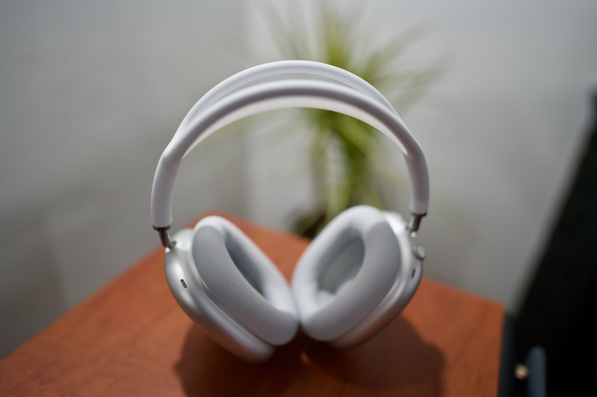
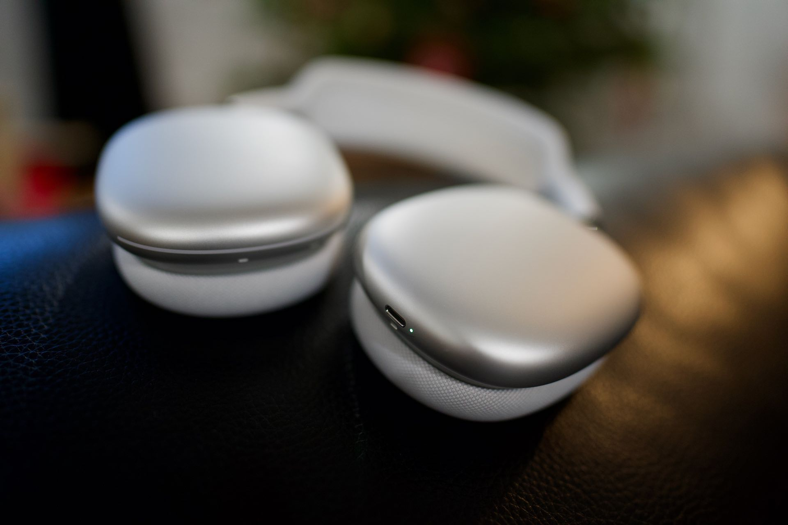
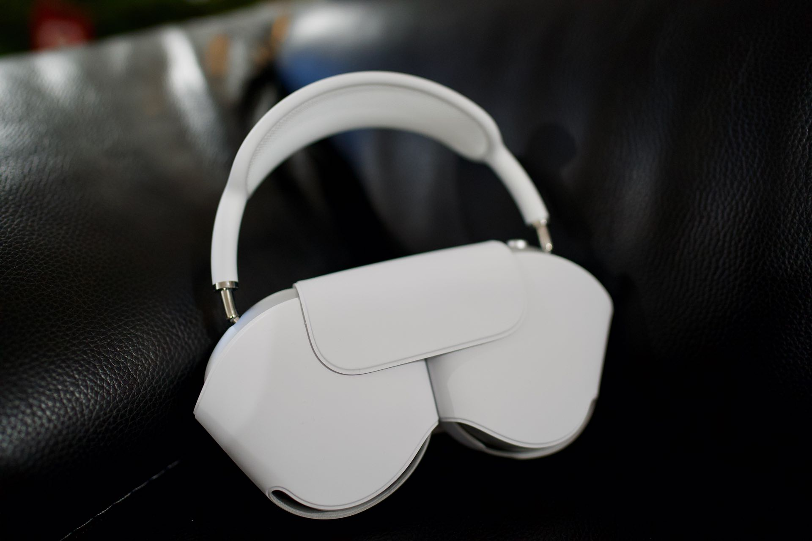
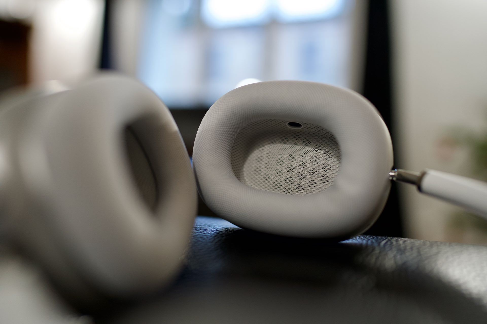
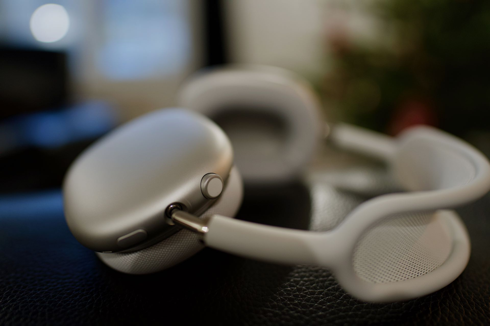
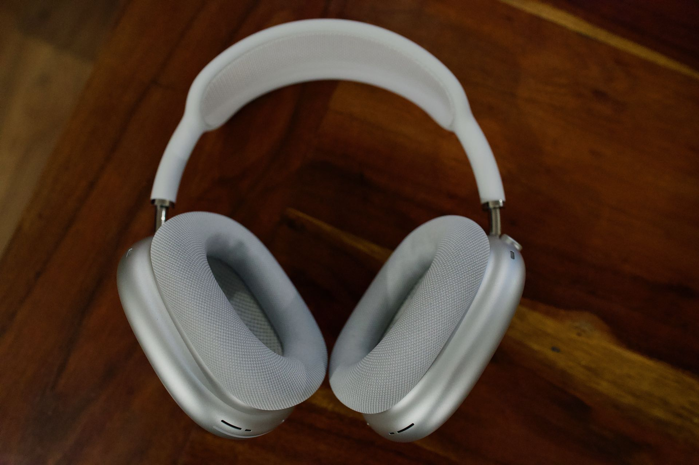
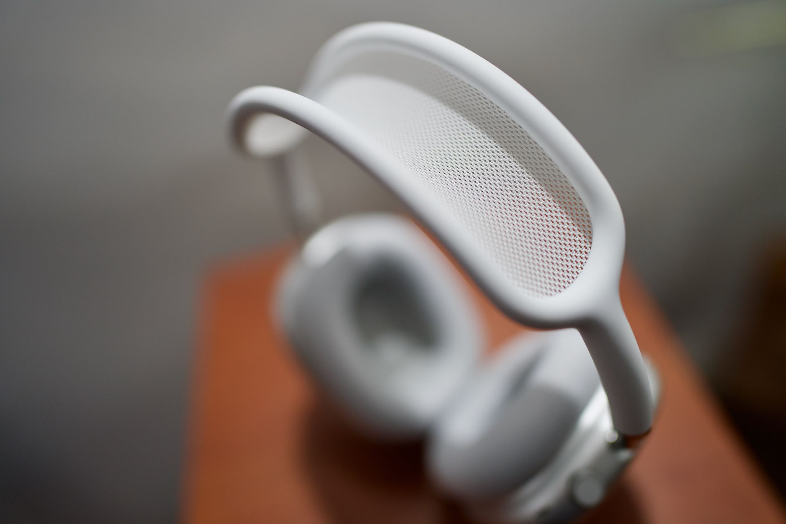

---
title: Retour sur les AirPods Max
description: Les AirPods Max viennent de sortir, tout le monde s’y attendez pourtant le prix fait parler. Alors pourquoi ils sont en rupture de stock ? Effet de mode ou révolution ?
tags:
- airpods
- apple
- casque
- casque-audio

author: iSebmo
date: 2020-12-19
categories:
- musique
- hightech

fimg: ""
--- 

C'est délirant ce que peut provoquer la sortie d'un nouveau produit chez Apple.
Cette marque est soit adorée, soit détestée, mais il n'y a pas d'entre-deux. Elle ne laisse pas indifférente, c’est fou ! Regardez quand elle a sorti les [AirPods](https://tfada.fr/deux-ans-et-demi-et-les-airpods-sont-morts/) (premier du nom), tout le monde se moquait :

> Des écouteurs en forme de coton de tige !

Et ces réactions se reproduisent tout le temps, pourtant baladez-vous dans la rue et vous allez être surpris de voir le nombre de gens qui portent ces cotons de tige dans les oreilles.

Nous allons parler des AirPods dans cet article, oui encore 🤣, et je vais donner mon point de vue *non objectif* 🤪.

# La cible 🤙
Le nomade ? Surtout pas, au vu de la boite de rangement qui n’est clairement pas adaptée. Les écouteurs ne se plient pas, ils prennent donc autant de place rangée que sur la tête !

Le sportif ? Non plus courir avec quelque chose d’aussi lourd sur la tête ce n’est même pas envisageable !

À l’extérieur dans les transports en commun ? Ce type de personne rejoint pour moi le nomade et clairement non. Dans les transports, vous avez besoin d’un objet sur lequel vous n’allez pas porter votre attention toutes les minutes ⌚️, un truc que tu mets en vrac dans ton sac 👜 au pire que tu peux faire tomber en te précipitant pour attraper le métro 🚃.

Dans un open space ? Ma foi, je pense qu’on touche déjà plus ce genre de personnes. Si vous travaillez dans un bureau avec beaucoup de monde autour de vous, vous êtes surement à la recherche d’un casque à réduction de bruit. Dans ce cas, les AirPods Max me semblent complètement adaptés. Mais ne les oubliez pas 😅 au risque qu’on vous les emprunte.

À la maison ? Oui mais pour les audiophiles 🎧 qui ne jurent que par le filaire et les casques ouverts. En revanche, pour ceux qui veulent se regarder un film tranquillement sans gêner le voisin, ceux-là seront ravis. 

En télétravail ? À certainement, je me reconnais plutôt dans cette catégorie ! Pouvoir porter le casque à longueur de journée sans l’enlever pour prendre un appel en Visio ! Avoir un bon casque pour écouter une musique permet de rester concentré 🥰.

# Le prix 💸
Le prix est un faux problème, mais beaucoup s’en préoccupent. Honnêtement moi le premier qui attendais ces écouteurs quand j’ai vu le prix j’ai failli passer mon tour. 
Quand je compare le prix d’un bon casque qui donne envie d’être porté en wireless, il n’y en a pas beaucoup. Les Momentums sont pas mal, mais en plastique et on est déjà à 400€. Chez Bang & Olufsen, on monte à 800€ pour un produit qui n’est même pas parfait selon la presse spécialisée !

Donc j’ai troqué mon Miio M11 et mon casque Meze, car le filaire ce n’est pas pour moi, comme le vinyle d’ailleurs. 

Et vous savez quoi ? Mio plus Meze ça fait le prix des AirPods !

# Mais où est la boite de rangement ? 📦
Le premier mot qui me vient à l’esprit : ridicule 🤨. Elle n’est même pas pratique ! Une simple sacoche aurait fait l’affaire et on n’en aurait pas parlé plus longtemps, mais là ?

Que s’est-il passé Apple tu veux en parler 🗣 ?

Pour ceux et celles qui ne connaissent pas la différence entre le Design et l’Ergonomie, cette fameuse boite pondue par Apple est un exemple parfait de quelque chose beau (Design), mais pas du tout pratique (ergonomique).
On se retrouve avec quelque chose de beau, mais qui ne sert à rien, mais vraiment à rien… Comment ne pas craindre d’emporter ce casque sans risquer de l’abimer ? Et c’est là que je vous renvoie à la cible de ce casque…

Un truc qui me dérange, lors de la sortie des écouteurs de la boîte les écouteurs s'entrechoquent 🥵. J'espère qu'à la longue ils ne vont pas marquer... donc quand je sors les écouteurs j'ai l'impression de sortir mes boules de pétanque. 

# Le son 🎧
J’ai eu les QC 35 et les XM3, j’avoue avoir préféré les Sony à l’époque par rapport au Bose, car beaucoup plus vivant. Je ne suis pourtant pas un amateur de basse, j’écoute principalement du Rock mais je peux être amener un bon vieux NTM, donc il faut des basses propres pour pas me filer la migraine. Et c’est bien un point fort de ces écouteurs, les basses ne sont pas trop envahissantes et je les trouve super bien définies.

À l’époque je testais des casques audiophiles, j’avais testé les [Dali](#) que j’ai retournés immédiatement je pense que c’est le produit qui a fait un retour direct. 

Bon et alors ces AirPods Max ? Le son est bluffant clairement au-dessus des Sony pour moi. Là où les Sony en font trop, ces AirPods savent être sur le fil autant dans les basses que dans les aigus. Du beau travail 👏. 

On est sur le meilleur casque 🎧 à réduction de bruit que j’ai pu tester. Pour un son plus aéré, il faut choisir un casque sans réduction de bruit. 

Bel équilibre, écouter du Ben Harper ou du Metallica et le casque s’en sort super bien 👍. 

Pour les fans des Pixies je vous encourage à écouter Hey 👋 le son de la basse de Kim est enivrant 🥂. 

Difficile de parler du rendu sans les écouter hein ? Pour faire une comparaison, si vous possédez un HomePod chez vous, et bien c’est simple c’est la même chose en termes de rendue sonore, mais en écouteurs. 

Un dernier point, lorsqu’il n’y a pas de son diffusé la réduction de bruit génère un bruit blanc que je trouve plus important que sur les AirPods Pro. Ce n’est pas forcément gênant car sur de la musique classique vous pouvez entendre tous les petits bruits qui remontent de la scène. 

# Tu m'entends ? 🎙
Le mode transparent c’est sûrement le point pour lequel j'ai acheté en priorité ce casque. Je ne sais pas si vous arrivez à utiliser le même mode chez Sony, mais je trouve impossible d'avoir une conversation normale sans quitter le casque. Avec les AirPods Max, c’est royal et on les garde même pour les Visio !

Est-ce que les autres m'entendent ? Difficile de faire mieux que les AirPods Pro sur ce point. Encore une des fonctionnalités qui m'ont dirigé vers l'achat de ce casque par rapport à la concurrence. Bien évidemment les AirPods Max ne font pas aussi bien que les casques de gamer avec un micro déporté. 

# Le confort 🧸
Le casque fait plus de 300g, mais honnêtement je ne le sens pas dans les circonstances de mon utilisation revoir la partie cible à qui s'adresse ce casque. 

En revanche, on est en hiver ou presque 🥶 et il tient chaud le bougre. Donc attention ⛔️ si vous l'utilisez en intérieur l'été sans climatisation ça risque de chauffer 🥵. 

Il faut quand même remettre dans le contexte, ils tiennent chaud, mais en rapport avec des casques avec les coussinets en cuir il s'en sort plutôt bien. 

Après le confort est exceptionnel pour un produit aussi lourd ! J'entends par là, pas aussi bon que le QC 35 qui reste la référence, mais les AirPods Max sont vraiment bons sans. Aucune pression sur le haut du crâne ne se fait ressentir au bout de plusieurs heures d’utilisation 💀. Pour ceux qui connaissent le Meze, le confort et la pression sur le crâne sont les mêmes. 

S'il fallait lui trouver un défaut au niveau du confort je dirais qui sert un peu fort à la longue au niveau des tempes. Cependant, je vous déconseille de manger ou mâcher un chewing-gum tout en portant le casque sur les oreilles, sinon c’est la douleur assurée. 

L’ensemble fait un peu de bruit quand on bouge la tête, notamment les coussinets, ils ont tendance à faire un léger craquement lors des mouvements. La structure en métal en revanche ne bronche pas, pas un bruit.

# Mon avis 🙊
Je n'ai pas parlé de l'ergonomie, bien que l'emplacement des boutons en haut 👆 n'est pas forcément le meilleur endroit, car on a vite fait d'appuyer sur un bouton lorsqu'on ajuste le casque.
En revanche, passer du mode transparence en un seul appui c’est très pratique. Je travaille sur mon ordinateur tout au long de la journée, passer de la Visio en mode transparence est un vrai plaisir alors que c’est un supplice chez les concurrents. 

Apple n’est pas tombé dans le piège du tout tactile et l’idée de la molette, pour régler le volume, est un modèle d'ergonomie et qu'est-ce que c’est fluide !

Petit détail qui tue lorsque vous tournez la molette un discret clic est envoyé à l'intérieur des écouteurs. Subtile, mais c’est le genre de détail que j'adore chez Apple. 

Voilà pour le tour du propriétaire, je sais que mon avis ne vaut  pas grand chose et que le monde de l’audio est suspendu au test de PPG (pépé ji 🤙).