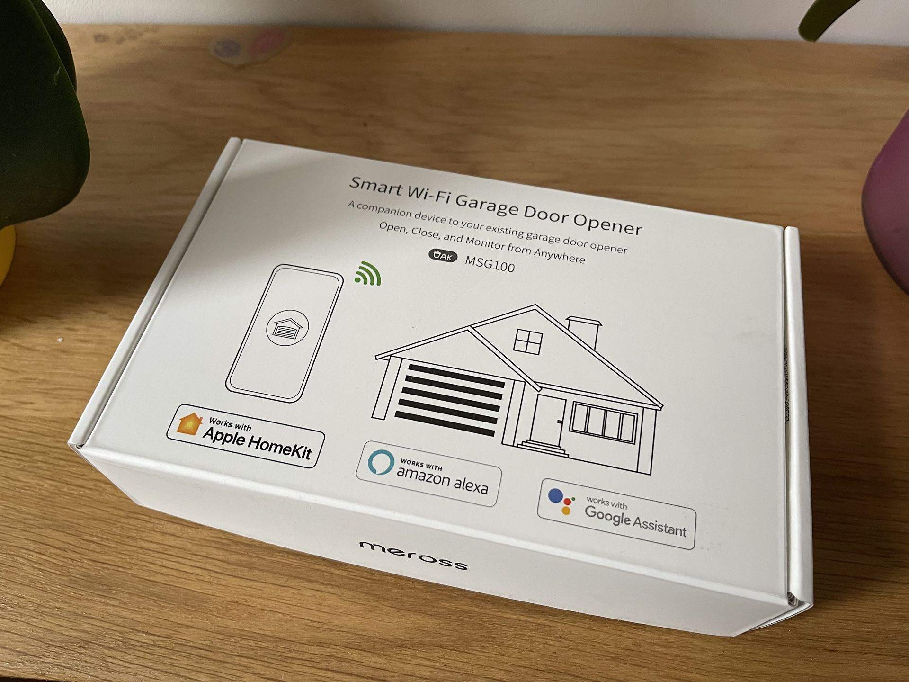
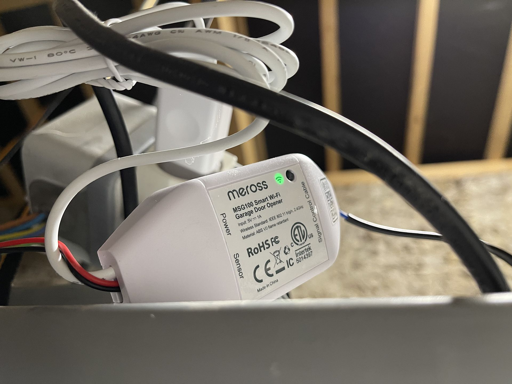
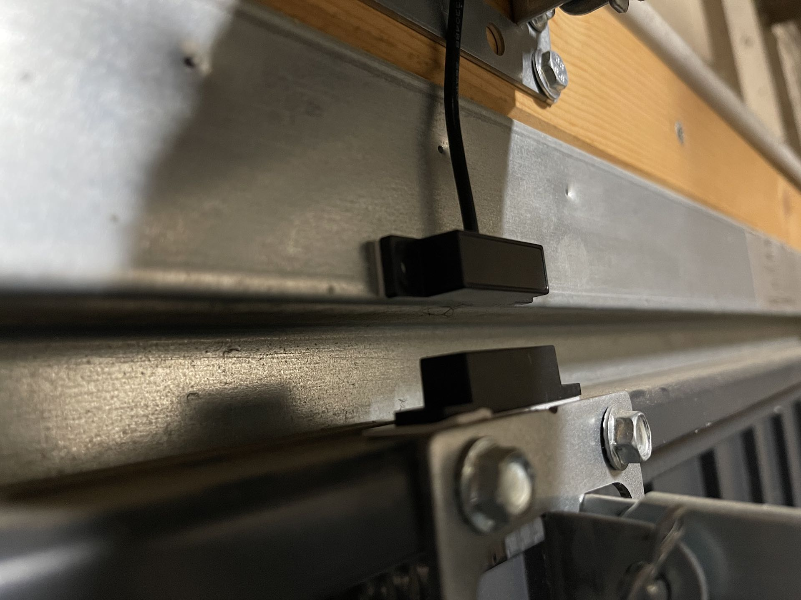
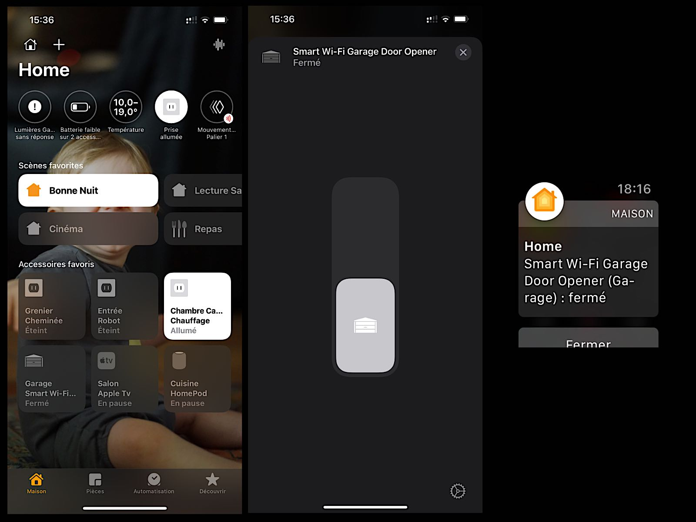

---
title: Avec Meross ma porte de garage intelligente sous HomeKit
description: Transformer sa porte de garage en porte intelligente sous HomeKit. Plus besoin de télécommande partez avec votre iPhone et le tour est joué. 
tags:
- apple
- Homekit

author: iSebmo
date: 2021-01-26
categories:
- hightech

fimg: ""
--- 

Si vous avez un garage avec une porte motorisée vous avez sûrement envie de la rendre compatible avec HomeKit afin de la gérer depuis Siri et l'application maison. Et bien sachez qu'avec [ce kit](https://www.amazon.fr/gp/product/B08HV41Q5W/ref=ppx_yo_dt_b_asin_title_o05_s00?ie=UTF8&psc=1) de la marque Meross, c’est possible et extrêmement simple à mettre en place. 

J'ai une porte de garage tout ce qu'il y a de plus classique, la marque est [Chamberlain](https://www.leroymerlin.fr/produits/motorisation-de-garage-connecte-a-courroie-chamberlain-ml700ev-69612984.html) que vous trouverez sans problème chez Leroy Merlin. Ajouter lui 50€ pour le [kit Meross](https://www.amazon.fr/gp/product/B08HV41Q5W/ref=ppx_yo_dt_b_asin_title_o05_s00?ie=UTF8&psc=1) et elle devient intelligente.

J’entends par intelligente la possibilité d’être notifié quand elle s’ouvre, quand elle se ferme. Je peux ouvrir l’application Maison et voir le statut ouvert ou fermé de la porte ! En plus je peux contrôler que tout est OK à l’aide de la caméra connectée et compatible HomeKit également. 

L’installation est simple, il vous faut une prise 220v à portée pour brancher le module dessus, un câble va se brancher à la place en plus du bouton qui permet d’ouvrir et fermer la porte (c’est ce qu’on appelle un contact sec). Enfin, le dernier câble est à tirer au niveau de la porte du garage, ce capteur permet de connaitre l’état d’ouverture.

Une fois tout branché, vous scanné l’icône HomeKit et roulez jeunesse, l’accessoire apparait comme par magie 🪄 dans l’application Maison 🏠. Et oui vous n’aurez pas besoin de télécharger l’application du fabricant et ça change tout 🥳.

Le seul près requis à son installation est la portée de votre Wifi. En effet le module va s'y connecter pour gérer la porte donc il vous faut du Wifi 📡 dans le garage. Personnellement depuis que j'ai investi dans un [kit Orbi](https://www.netgear.fr/orbi/) je n'ai jamais de problème de couverture wifi dans la maison 🏠. 

Voilà rien de bien compliqué ! Maintenant vous pouvez avoir une panne de télécommande si vous avez votre iPhone sur vous la porte s'ouvrira 😝. 

Je peux partir courir sans les clés 🔑 maintenant.