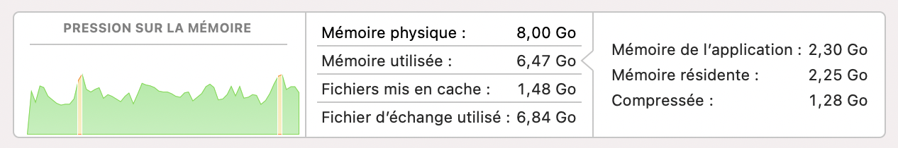
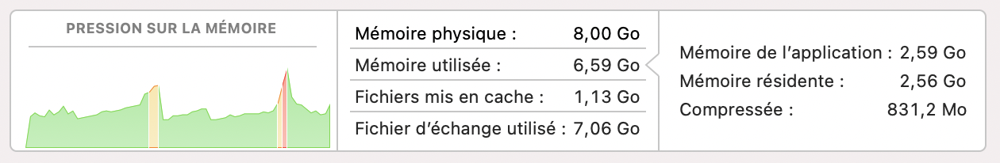
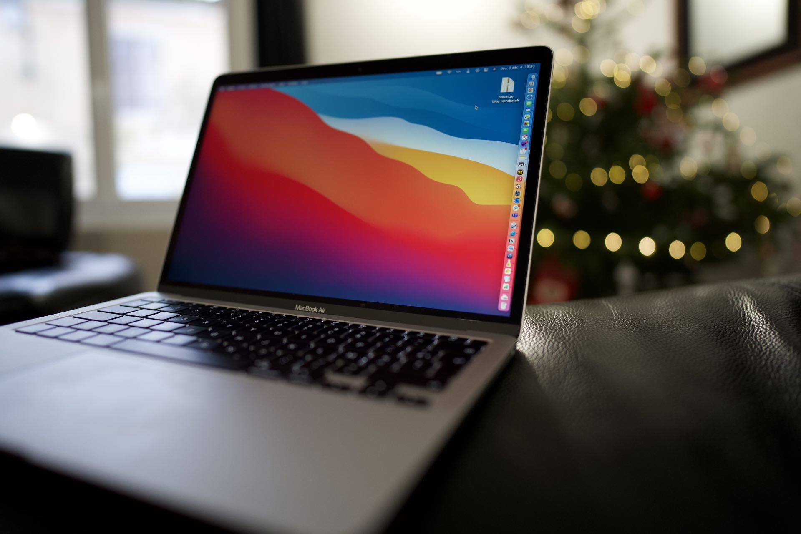

C'est la question du moment faut-il prendre 8go ou 16go de mémoire sur votre nouvel ordinateur Apple M1 ? J'ai fait le tour de la question en regardant les différentes vidéos disponibles sur le sujet. Il en ressort souvent deux choses, des comparatifs d'utilisation complètement loufoques, ou alors "prends le plus que tu peux te payer".

Bref avec tout ça, à la fin je ne suis pas plus avancé. J'ai donc commandé le modèle 8go et j'ai fait quelques tests sur une journée de travail classique. J'ai fait comme si de rien n'était, c’est-à-dire que je n'ai pas ouvert plus ou moins d'applications. À certains moments de la journée j'ai eu quelques ralentissements. Rien de bien méchant, mais suffisamment pour que je m'en aperçoive.

J'ai donc ouvert le moniteur d'activités afin de jeter un oeil sur l'onglet mémoire. Voici ce que j'ai trouvé :

Vous voyez les petits pics en jaune, ces pics indiquent que le système était en manque de mémoire. Il a dû ralentir certaines taches et utiliser le maximum de mémoire disque (fichier d'échange en français).

Sur cette capture d'écran on voit que j'utilise quasiment la même quantité de mémoire disque que de mémoire vive.

Cette capture a été prise quelques instants plus tard. Je ne faisais pas forcément plus de choses, mais clairement on voit que j'étais en limite du système (pour pic rouge).

La morale de l'histoire ? Testez par vous-même sur une journée type avec les logiciels que vous utilisez d'habitude ! 

Il y a fort à parier que la demande en mémoire diminuera au fur et à mesure de l’optimisation des logiciels qui ne tourneront plus sous Rosetta. 

Vous vous demandez maintenant quels sont les logiciels que j’ouvre simultanément lors d’une journée type. Alors ne perdons pas plus de temps les voici :

- Slack bêta version silicon 
- Microsoft Teams
- Outlook beta version silicon
- Excel
- Table Plus
- Vs code
- Safari (5 onglets ouverts)
- Google chrome (10 onglets ouverts)
- Reeder 
- Tweetbot 
- Apple mail
- Notion

Quand Docker sera compatible, il faudra le rajouter à la liste. 

L’ordinateur est branché sur un écran LG 5K et le MacBook Air reste ouvert pour profiter des deux écrans. Ce détail a son importance, car la mémoire du GPU est partagée avec celle du CPU. 

Si vous vous retrouvez dans ce profil d’utilisateur alors je ne peux que vous conseiller d’investir dans le modèle 16go de RAM. 