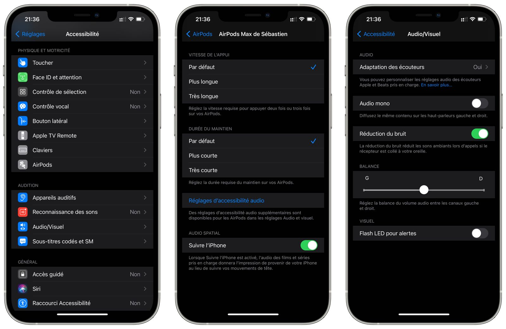
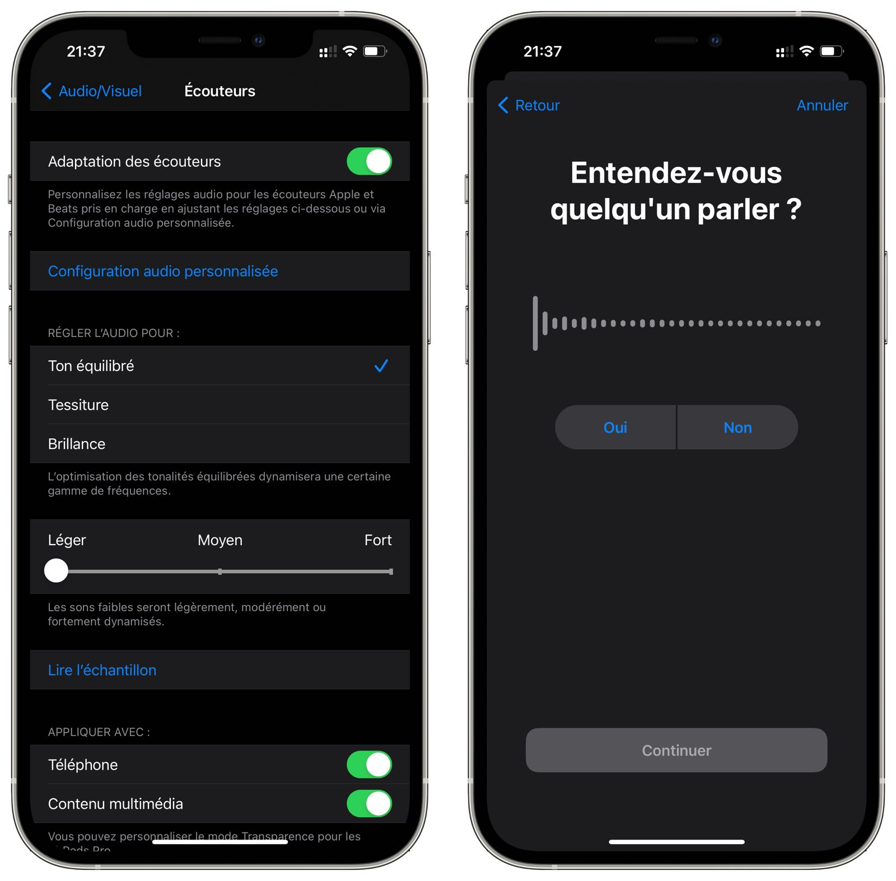

Depuis la sortie d’iOS 14 Apple a mis le paquet 📦 sur les réglages d'accessibilité. Ce petit menu devient un vrai fourre-tout ! Une fonctionnalité que j'aime plus particulièrement c'est la gestion du tapotement derrière l'iPhone qui permet de lancer l'action de son choix. Revenons à nos moutons. 

Si vous souhaitez aller au bout de l'expérience de vos AirPods (ça fonctionne également avec des casques Beats 🎧) je vous suggère d'aller dans les réglages : 

Vous allez entendre 👂 un certains nombres de bruits et devrez répondre quelle version vous plait le plus. C'est un égaliseur vraiment personnalisé et automatique 🥰 !

Vous pouvez toujours revenir à la configuration précédente, donc je vous encourage à tester vous ne risquez rien. 

Seul 😢 regret l'expérience n'est plus la même quand j'écoute un morceau sur le Mac qui ne dispose pas de la même fonction. 