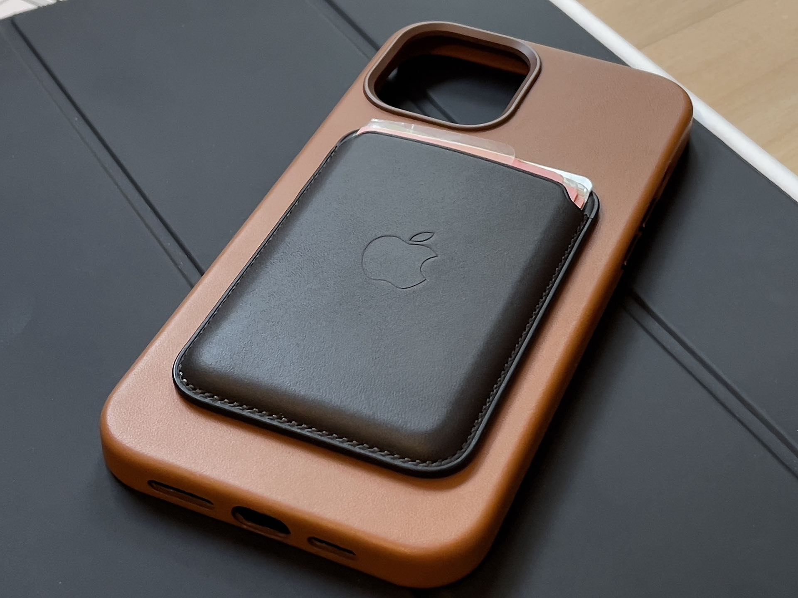
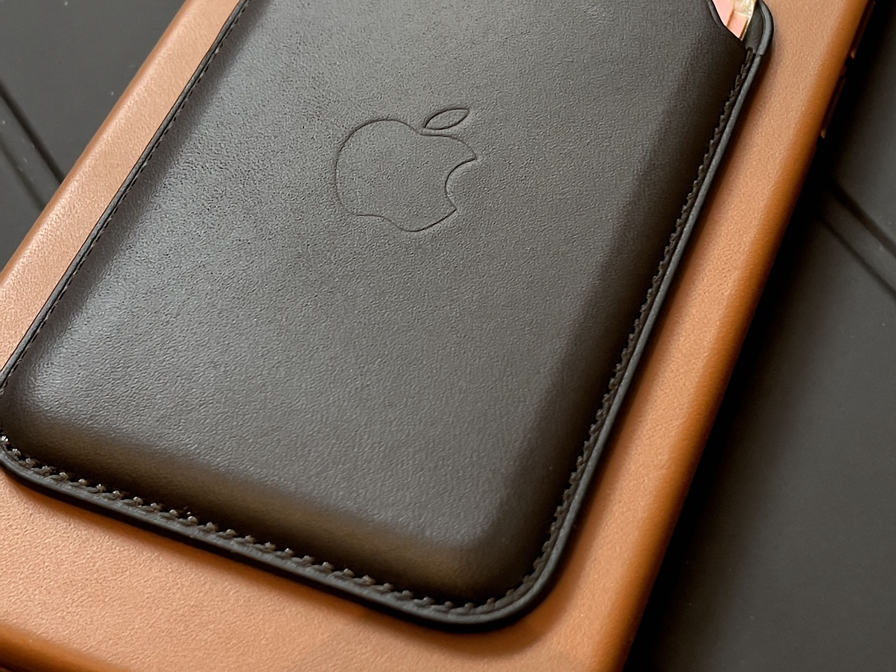
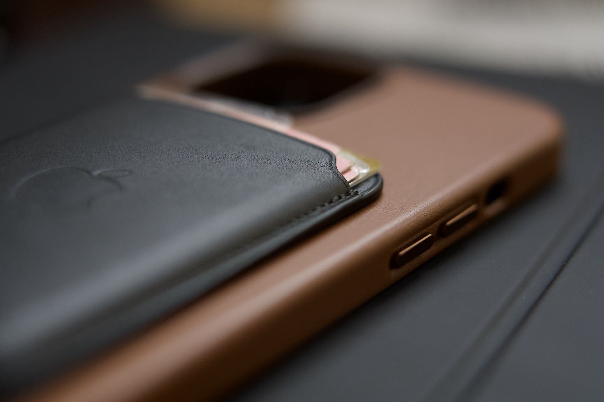
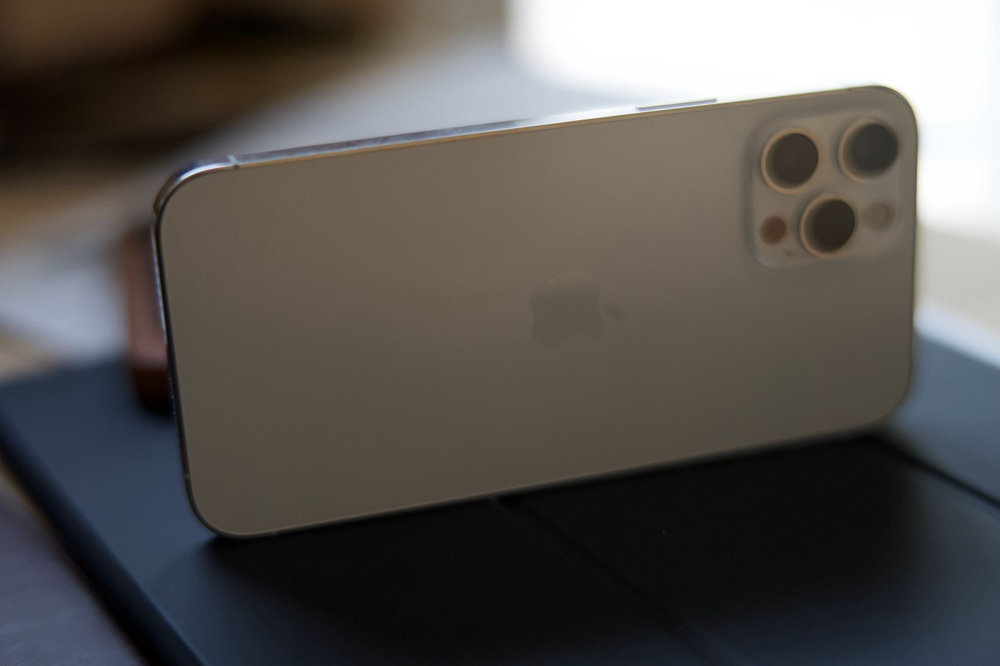
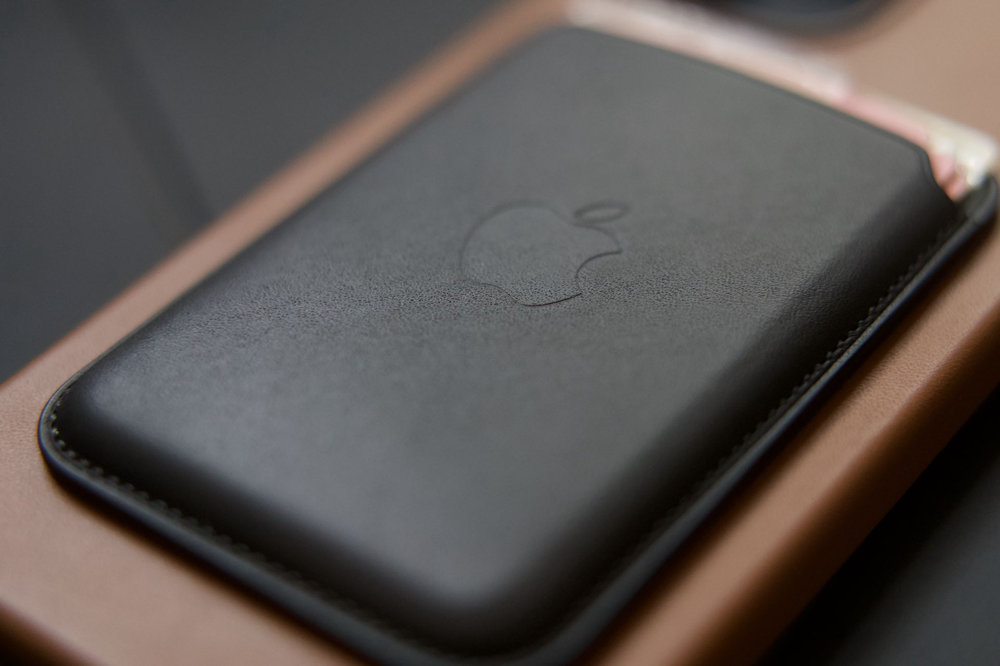

Depuis les iPhone 12 Apple a sorti un nouveau type d’accessoire basé sur MagSafe. Sous ce nom bizarre se cache un aimant dans la coque arrière de votre téléphone qui permet de mieux agripper des accessoires qu’on lui colle dessus. 

## Une coque et un porte-cartes inefficace 💩 
J’ai testé la coque cuir MagSafe ainsi que le porte-cartes et je vous dis pourquoi je suis déçu 😞. 

La coque en elle-même est plutôt bien finie, je n’en ai jamais eu par le passé donc je ne me prononcerai pas sur sa durée de vie. Les boutons métalliques apportent une réelle perception de qualité au produit. L’intérieur est recouvert d’un revêtement doux qui change des revêtements en dur de certaines coques. 

Sur un iPhone 12 Pro Max, la coque ajoute encore plus d’épaisseur au téléphone déjà sur dimensionné, ce qui gêne la maniabilité à une main. J’avoue que je suis fan des coques Peel non pas pour leur qualité de fabrication, mais parce que le constructeur à compris qu’une coque dénature un iPhone et que plus elle est fine mieux c’est, en tout cas en termes de prise en main ✋. 
En plus d’ajouter de l’épaisseur à l’iPhone la coque est relativement lourde. 

Parlons de l’apport de Magsafe, Apple ne se cache pas en montrant bien les effets que peut engendrer l’utilisation de la recharge sans fil Magsafe à sa coque. En effet, au bout d’un moment le rond de l’aimant peut apparaitre sur la coque elle-même ! Surprenant non ? En tout cas c’est surprenant que ce genre de détails de la part d’Apple ne soit pas réglé d’une manière ou d’une autre, on achète un produit à plus de 60 balles qui va s’abimer avec le temps. 

Un petit détail que je trouve adorable lors de la mise en place de l’iPhone dans la coque, une petite animation de la couleur de la coque apparait sur le téléphone 🥰.

Concernant le porte-carte, je ne lui ai pas trouvé d’utilité, alors oui il améliore la prise en main du téléphone avec sa petite bosse au dos. Mais je ne vois pas l’intérêt d’ajouter le porte-carte au dos de mon iPhone. Quand je pars avec le téléphone il faut penser à le mettre au dos, quand j’arrive dans la voiture il faut penser à l’enlever sinon il ne rentre pas sur son support. Donc à ce moment je me retrouve avec la porte-carte dans la poche comme un porte-carte classique. J’arrive à la maison je ne garde pas le porte-carte sur le téléphone donc je le pose au risque de l’oublier en partant… Non je ne sais pas vous, mais je ne lui ai pas trouvé d’utilité. 🤷‍♂️ 
À noter que le porte-carte aimanté directement au dos de l’iPhone sans coque aura tendance à bouger sur le revêtement en verre…

Pour un produit à 65€, il faut quand même qu’il serve à quelque chose !

## Un ☝️ support voiture 🚙 qui ne charge pas ⚡️ 
La bonne idée du chargeur Belkin est de reprendre l’aimant à son avantage afin de coller votre iPhone sur le support. Vous n’avez plus besoin de mâchoire qui vient manger 🍽 votre téléphone 📞, c’est un réel gain de temps et le côté pratique en fait un accessoire indispensable, pourtant…

Oui sur le papier ce support et top, mais quand on regarde plus près, il ne permet de pas la recharge… Mais pourquoi s’arrêter à un simple aimant 🧲 alors que l’ajout de la recharge sans fil aurait tout fait changer. Je suis triste de voir un objet qui pourrait faire un malheur s’arrêter en si bon chemin. 

D’ailleurs pour la petite histoire, j’ai commandé ce support en pensant naïvement que la recharge sans fil était intégrée, mais non erreur 😢.

## Un bel avenir, mais c’est un peu trop tôt
Je pense que Magsafe a un bel avenir, mais sa sortie est un peu précipitée, les constructeurs n’ont pas eu le temps de sortir des accessoires terminé. Il faut surement lui donner encore une petite année, et je pense que le monde Android devra s’y mettre aussi afin de créer un éco système complet à des tarifs moins Apple… 🏷 

Pour l’instant Apple s’est complètement trompé dans sa sortie de ses propres accessoires, soit c’est [trop cher](https://www.mac4ever.com/dossiers/159427_test-du-chargeur-magsafe-duo-d-apple-vraiment-trop-cher), soit complètement mal pensée : le chargeur qui colle à l’iPhone et pour lequel il faut les deux mains pour le sortir de sa base, quelle régression. 