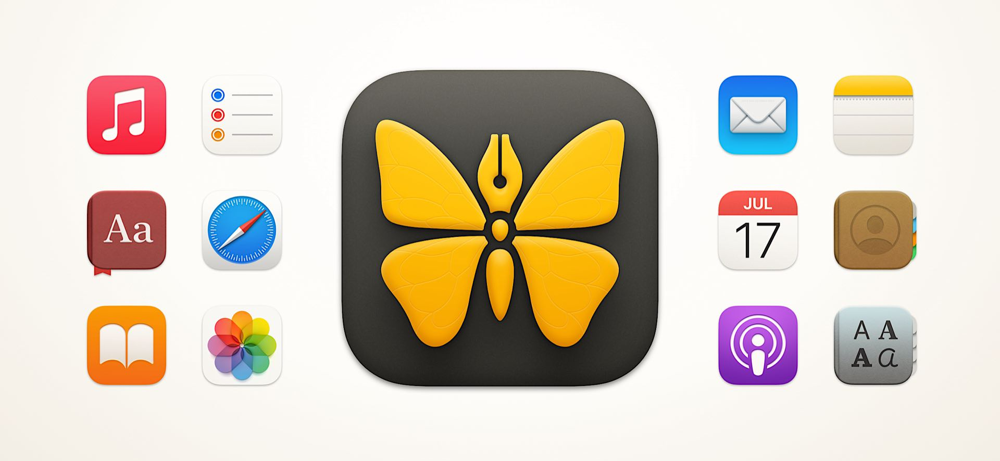
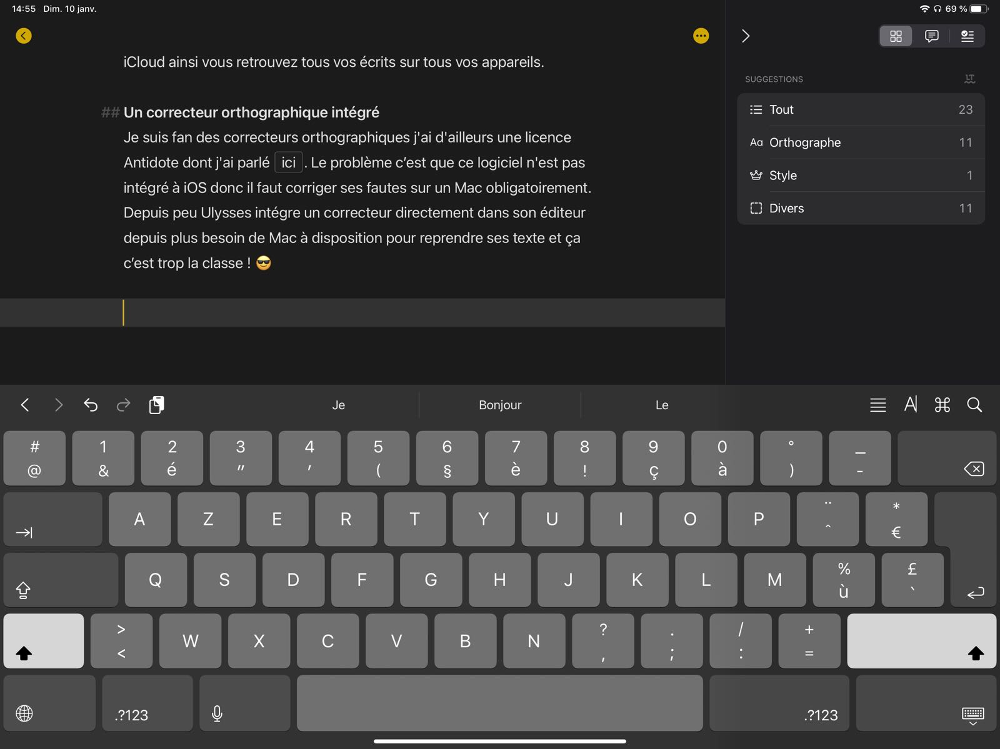

---
title: Ulysses la meilleure application sur Mac
description: Ulysses est pour moi la meilleure application d’écriture sur Mac et iOS ! Je vous encourage à prendre de bonnes résolutions d’écriture de contenus pour cette nouvelle année. 
tags:
- setapp
- app

author: iSebmo
date: 2021-01-12
categories:
- applications

fimg: ""
--- 
Laissez-moi vous parler de la meilleure application d'écriture sur Mac. [Ulysses](https://ulysses.app/features/) est une application universelle, vous profitez ainsi des mêmes fonctionnalités sur Mac et iOS. 

C'est peut-être la seule application qui me fait rester sur un iPhone, c'est dire sa qualité. 

## Public ciblé
Le public cible est avant tout celui qui connaît le langage Markdown car tout le principe d’Ulysses repose sur ce langage. Il n’a rien de compliqué et je vous encourage à l’utiliser autant que possible ! Une fois maitrisé fini les prise de tête avec la mise en page Word et ses chapitres qui ne recommencent pas depuis le début 😂. 

Les utilisateurs de cette application sont :

- les écrivains en herbe 
- les blogueurs 
- les utilisateurs de Evernote ?
- ceux qui tiennent un journal (DayOne)

Personnellement je l’utilise pour blogger et tenir le journal à l’intérieur de l’application. Le contenu est synchronisé avec iCloud, vous pouvez en faire autant avec DropBox, ce qui vous permet d’être à jour sur tous vos équipements et d’avoir votre contenu sauvegardé automatiquement. 

## Le style
Commençons par le style de l’application, car le but d’une application où on passe son temps à écrire c’est de s’y sentir bien.

Vous pouvez customiser l’interface pour absolument tout, de la police d’écriture jusqu’à la couleur des liens dans le texte.
J’aime le thème de base avec le fond noir que je trouve reposant. Surtout en mode plein écran, le thème sombre permet de moins se fatiguer les yeux.

En parlant de plein écran vous avez la possibilité de mettre le texte seul en plain écran pour éviter toute distraction.

Je suis adepte de l’écriture façon machine à écrire. C’est une option qui permet de faire défiler le texte pendant l’écriture. Au fil de l’écriture de l’article, la ligne de base reste au niveau choisi et le texte défile tout seul vers le haut c’est vraiment “trop bien”. Les yeux n’ont pas à bouger pendant l’écriture du texte, n’ayant pas connu de machine à écrire je peux vous assurer que c’était un réel confort.

## L’organisation
L’application vous laisse vous organiser comme bon vous semble. Vous avez la possibilité de classer vos notes dans des dossiers et sous dossiers comme vous le feriez dans Finder. Vous avez aussi la possibilité d’ajouter des tags à vos notes pour les retrouver plus facilement. 

La recherche n’est pas en reste et vous permet de rechercher de manière ultra précise une note en filtrant sur un peu tous les paramètres imaginables (recherche dans les titres, des mots en gras, en italiques…). Seul regret il n’est pas possible de sauvegarder les recherches à la manière d’Evernote.

Vous avez la possibilités d’ajouter des descriptions aux notes, d’y associer des images pour les retrouver à côté de votre article.

Une autre fonctionnalité sympathique pour ceux et celles qui se donnent des objectifs, il est possible d’ajouter un objectif en nombre de mots dans l’article. Il ne vous reste plus qu’à afficher la colonne de droite en glissant vos doigts vers la droite pour faire apparaitre en direct vos objectifs et combien de mots il vous manque. Vous avez également une prévisualisation de temps de lecture de votre article.

## L’exportation
Les capacités d’exportation ne sont pas en reste. Vous pouvez exporter vos notes en plusieurs formats :
- ePub
- pdf
- docx
- text
- html
- blog

Pour chaque format d’export vous pouvez associer un template, les template de base sont sympathiques pour les ePub.

Les capacités d’export vers les blogs sont puissants, vous pouvez exporter vers WordPress ou Medium. Il n’y a pas encore de possibilité d’exporter vers un blog sous [Ghost](https://ghost.org) mais un petit tweet sur Twitter à l’équipe me laisse penser que ça peut être possible.

## Gestion de versions
Plus besoin de vous soucier de revenir à une version antérieure Ulysses le prend en charge par défaut. Vous avez écrit des bêtises et vous voulez revenir à ce paragraphe que vous avez supprimé ? Pas de problème ! ✌️

Vous ne perdrez plus votre travail dès lors que vous travaillez dans Ulysses. Vous avez la possibilité de synchroniser vos notes au travers d’iCloud ainsi vous retrouvez tous vos écrits sur tous vos appareils. 

## Un correcteur orthographique intégré 
Je suis fan des correcteurs orthographiques j'ai d'ailleurs une licence Antidote dont j'ai parlé [ici](https://tfada.fr/corriger-vos-fautes-dorthographe-depuis-nimporte-o%C3%B9./). Le problème c’est que ce logiciel n'est pas intégré à iOS, donc il faut corriger ses fautes sur un Mac obligatoirement. Depuis peu [Ulysses](https://ulysses.app/features/) intègre un correcteur directement dans son éditeur depuis plus besoin de Mac à disposition pour reprendre ses textes et ça c’est trop la classe ! 😎

Sur chaque feuille vous avez la possibilité de vérifier l'orthographe avec des suggestions. On n’est pas au niveau d’Antidote, mais c'est vraiment une correction de bon niveau. 

## Conclusion
Ulysses est compris dans l'abonnement [SetApp](https://tfada.fr/jai-test%C3%A9-setapp-lalternative-%C3%A0-lapp-store/) donc j'ai parlé ici. Il faudra souscrire à plus d’un écran pour en profiter sur plusieurs appareils iOS. On n’a pas parlé du coup, mais à quasi 60€ en abonnement le logiciel n'est pas donné et je vous recommande de passer par SetApp surtout que vous pouvez ainsi profiter de bien plus de logiciels. 

Vous l'avez compris dès le début de cet article je suis fan de ce logiciel pourtant je connais pas mal de logiciels d'écriture en Markdown, mais [Ulysses](https://ulysses.app/features/) fournit pour moi la meilleure expérience utilisateur. 