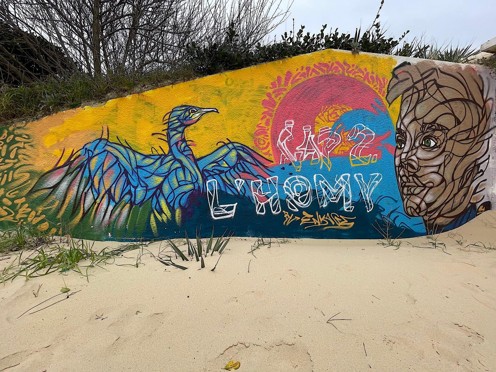

---
title: Revue de presse du mois de mars 2021
description: Comme chaque mois voici les titres de presse qui m’ont marqué. 
tags: 
- revuepresse
author: iSebmo
date: 2021-04-01
categories: 
- ByTheWay
fimg: ""
--- 

[https://www.theverge.com/2021/3/24/22347905/tesla-bitcoin-payment-us-cryptocurrency-elon-musk](https://www.theverge.com/2021/3/24/22347905/tesla-bitcoin-payment-us-cryptocurrency-elon-musk)

> You can now buy a Tesla with bitcoin in the US

[https://korben.info/azusaga-kuyuki.html](https://korben.info/azusaga-kuyuki.html)

> Pour ces gens qui perdent leur temp sur les réseaux sociaux. 

[Netflix is trying to crack down on password sharing with new test - The Verge](https://www.theverge.com/2021/3/11/22325831/netflix-password-sharing-test-feature-piracy-security-streaming-video)

> Peut-être la fin du partage de comptes sur Netflix.

[Bitwarden adds secure text and file transfer to its arsenal - The Verge](https://www.theverge.com/2021/3/12/22327834/bitwarden-secure-text-file-transfer-encryption)

> Bitwarden s’améliore et permet de partager des fichiers de manière sécurisée.

[Lien](https://lifehacker.com/how-to-import-passwords-from-csv-files-in-edge-chromiu-1846432354)

> Edge se bonifie et permet d’importer ses mots de passe depuis un fichier CSV

[Lien](https://ioshacker.com/how-to/prevent-carplay-from-connecting-without-face-id-or-passcode)

> Connecter son iPhone à CarPlay sans code

[Lien](https://www.youtube.com/watch?v=HbxWGjQ2szQ&t=83s)

> Quand Amazon plagie [Peak Design](https://www.peakdesign.com/)...

[Google is Evil](https://twitter.com/DuckDuckGo/status/1371509053613084679?s=20%0A)

> Google pompe tes données mais tu le sais déjà.

[HomePod is over](https://www.theverge.com/2021/3/12/22328436/apple-discontinues-original-homepod-mini)

> Apple arrête le [HomePod](https://tfada.fr/mon-avis-sur-le-homepod/), dommage je l’aimais bien cette petite enceinte.

[Lien ](https://www.theverge.com/2021/3/4/22313831/ios-14-5-default-music-service-siri-requests-apple-update)

> Non tu ne pourras pas choisir ton lecteur de musique par défaut sur iOS…

[Lien](https://www.eff.org/deeplinks/2021/03/googles-floc-terrible-idea)

> Article un peu technique qui t’explique la prochaine astuce de Google et de son navigateur pour te pomper tes données

[Lien](https://techcrunch.com/2021/03/03/brave-is-launching-its-own-search-engine-with-the-help-of-ex-cliqz-devs-and-tech/)

> Brave va lancer son propre moteur de recherche je me suis inscrit pour tester dès qu’il est dispo ✌️

[Lien](https://korben.info/boostez-firefox-interface-proton.html%0A)

> Firefox s’améliore encore mais c'est en bêta pour l’instant

[Lien](https://www.zdnet.fr/actualites/mozilla-firefox-renforce-la-protection-de-la-vie-privee-des-utilisateurs-avec-firefox-87-39919811.htm#xtor=123456)

> [Firefox](https://tfada.fr/brave-vs-firefox-en-2021/) renforce la vie privée de ses utilisateurs !