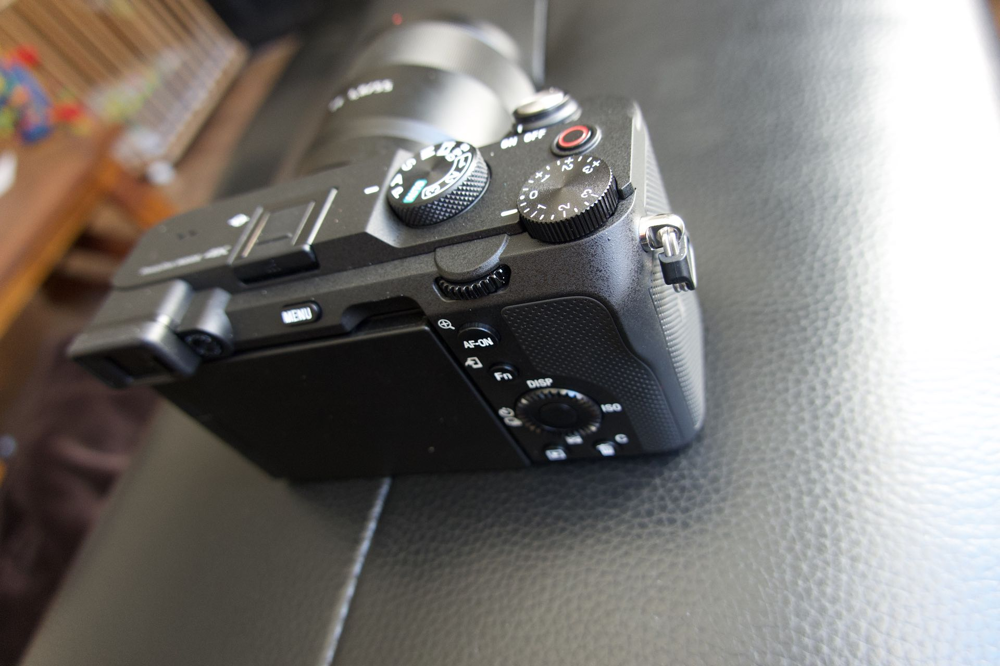
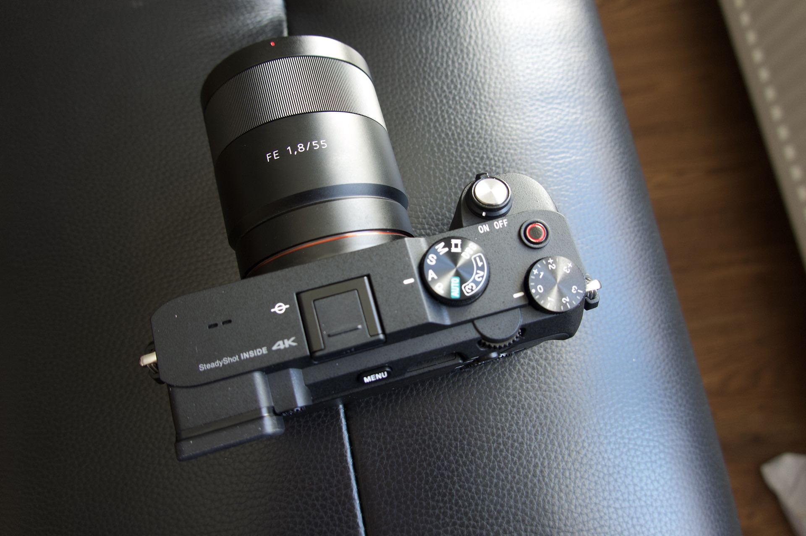
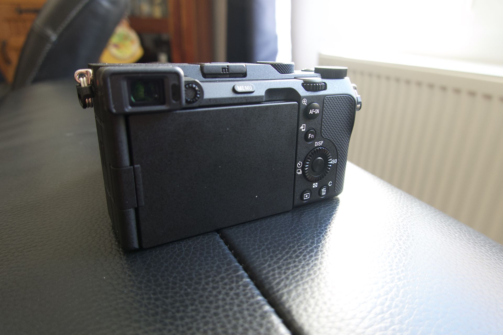
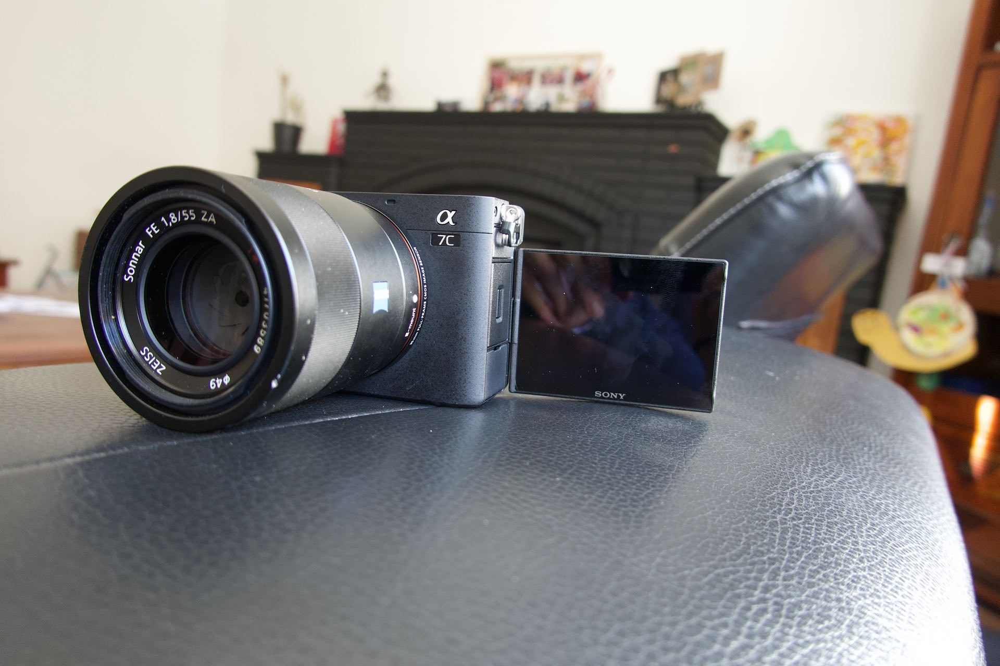
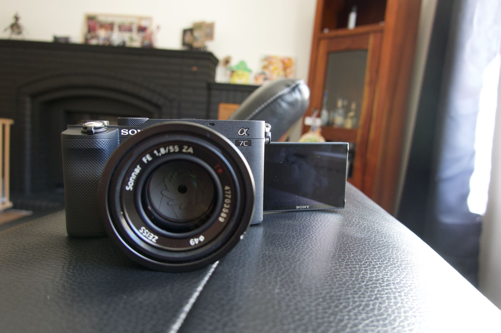
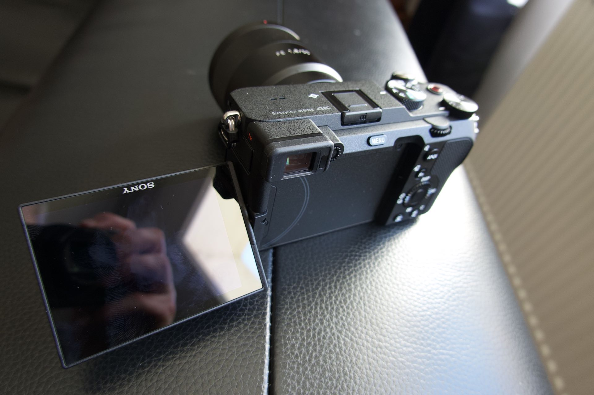
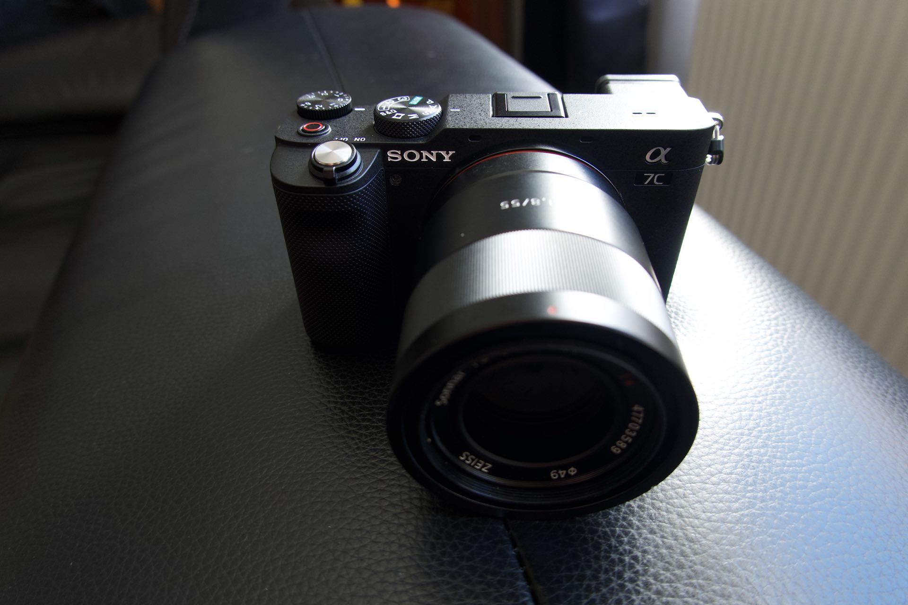

 
Sony sort en 2020 un nouveau boitier, toujours des noms à coucher dehors, cette fois il s'appelle A7C, on dira que le "C" signifie compact. Ce boitier a la particularité de reprendre grosso modo les fonctionnalités du A7III dans un boitier plus petit et plus léger.

En 2013 quand j'ai acheté le Sony A7R je voulais remplacer mon gros boitier A77 par un boitier plus compact, c'était un appareil extraordinaire à l'époque, un boitier full frame plus petit qu'un APSC. Puis la gamme A7 a évolué et le boitier a pris petit à petit de l'embonpoint. La taille a évolué lors de l'ajout du stabilisateur interne et le poids aussi. 

Après [mon passage](https://tfada.fr/passage-dun-a7r-%C3%A0-un-leica-q/) chez Leica avec le Q, je possédais là mon premier boitier avec le viewfinder à gauche plutôt qu'au milieu du boitier. Une fois habitué à ce positionnement j'ai eu du mal à revenir avec une visée centrée, le nez touche l'écran à chaque fois, ce n'est pas naturel. Du coup j'ai eu beaucoup de mal à me réhabituer au viseur du Sony A7III. De plus, je trouve le viseur au milieu **inesthétique**, inconfortable et rajoute de l'embonpoint à l'appareil avec cette bosse en plein milieu. 

Donc quand Sony annonce le full frame le plus **petit** et le plus **léger** au monde avec un viseur placé à gauche je suis aux anges 👼. Sony revient aux sources, des appareils super performants dans des boitiers ultras compacts. Bien sûr dans les tests hormis le prix, tous les défauts cités sont dûs à cette compacité. Mais personnellement, je suis prêt à pas mal de sacrifices afin d’avoir un appareil aussi compact. 
Le boitier est presque aussi **compact** que le Leica Q, mais au moins j'ai la charge par USB intégrée 😅.

Ce que j'aime 😍 sur ce boitier en dehors de sa taille et son poids, c'est son nouvel écran sur rotule qui permet à la manière du Leica M10-D de complètement de le **fermer**. 

C'est une sensation spéciale de prendre des photos dans le viseur et uniquement au travers, sans prendre le temps de regarder la photo prise sur l’écran externe. Hors contrairement au [Leica M10-D](https://www.lemondedelaphoto.com/Leica-M10-D-sans-ecran-mais,14979.html), il n'y a pas besoin d'attendre d'être sur l'ordinateur pour voir les résultats, pour les plus impatients d'entres nous il suffit de retourner l'écran 😂 (ou de regarder dans le viseur).

Cet écran permet également de prendre des **selfies** ou de se filmer et d'avoir le retour instantané 🥰.

Enfin pour finir avec cet écran sur rotule, il n’est pas parfait et pour prendre une photo avec l’écran uniquement à l il n’est pas parfait et demande une manipulation supplémentaire par rapport à l’ancien afin de prendre une photo en paysage avec l’appareil vers le bas. Il faut dans ce cas ouvrir complètement l’écran puis l’orienter.

Au rang des regrets, Sony ne sait toujours pas faire des objets **désirables**, tout est **moche** chez eux… Le boitier ne déroge pas à cette règle, il est certes plus sobre que les boitiers A7 mais il ne fait clairement pas rêver. 
Prenez pas exemple le bouton de déclenchement, il est gris sur un appareil tout noir, trouver l'erreur. 
Regardez-moi le dernier [XE4](https://www.missnumerique.com/fujifilm-x-e4-noir-hybride-nu-p-50814.html) de chez Fujifilm il est trop **mignon**. 

En conclusion, j'adore ce boitier vous l'aurez compris, si vous cherchez comme moi le boitier full frame à objectifs interchangeables ultra compact, il n'y a pas mieux. Si vous lui collez aux fesses un Zeiss 35mm 2.8 de seulement 100 grammes, le tout pèse 600 grammes sur la balance !