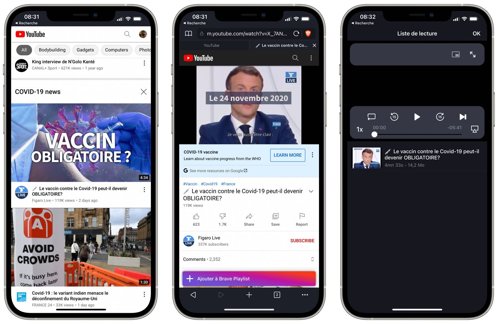

---
title: Comment écouter YouTube en arrière plan sur iPhone ?
description: Comment écouter une vidéo hors ligne et écran éteint sur iPhone, tout ça sans abonnement Premium ? Tout simple…
tags:
- apple
- ios
- google

author: iSebmo
date: 2021-06-03
categories:
- applications

fimg: ""
--- 
Vous le savez surement écouter YouTube écran éteint sur iPhone vous oblige à posséder un abonnement YouTube Premium. Ce forfait si vous n’utilisez pas la partie musique coute un bras… Mais vous disposez de l’écoute hors ligne, en arrière-plan et sans pub.

Alors, comment faire pour écouter sans ce forfait ? Il vous faut installer Brave qui est un navigateur qui va déjà supprimer toutes les publicités sur YouTube. Ce navigateur possède une fonctionnalité “playlist” qui vous permet comme son nom l’indique de faire une playlist à partir de n’importe quelle vidéo sur le web. Ce qui nous intéresse ici, c'est d’écouter une vidéo YouTube sans avoir l’écran de l’iPhone allumé alors pour ce faire il suffit d’aller sur le site depuis le navigateur Brave et de lancer une vidéo. Au lancement, vous allez voir un bouton apparaître “ajouter à la playlist”, il suffit de cliquer dessus et son téléchargement va commencer, une fois terminées la vidéo et disponible (menu option puis playlist), vous pouvez lancer la vidéo et éteindre l’écran du téléphone.

Vous remarquerez une chose problématique pour le moment la playlist sous Brave ne conserve pas l’endroit où vous vous êtes arrêtez dans la vidéo. Donc à chaque fois que vous allez reprendre, la vidéo va se jouer depuis le début 😅.