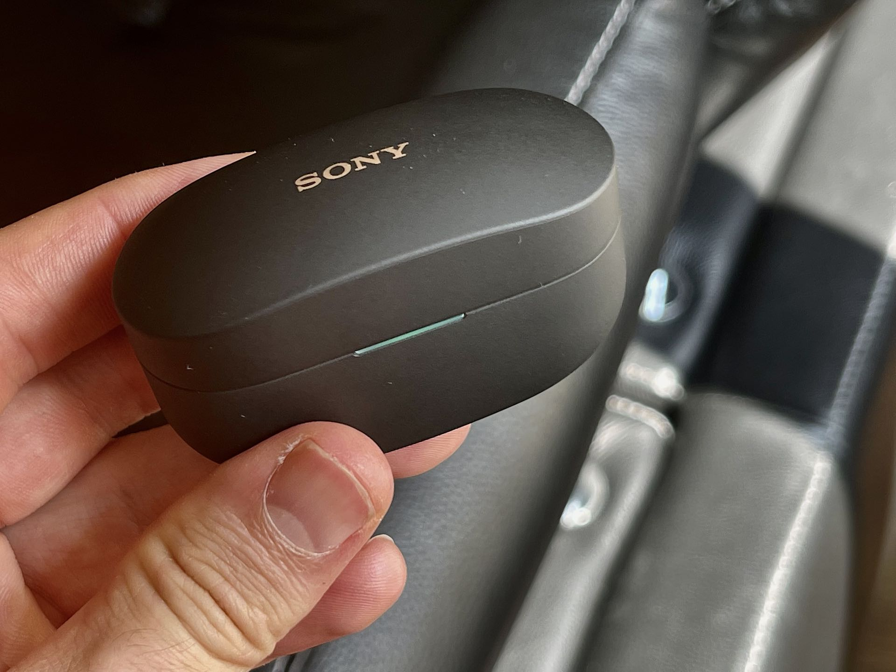
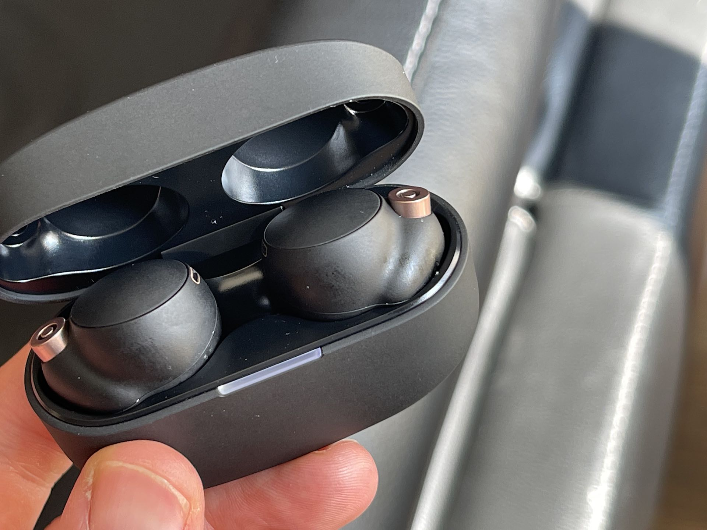
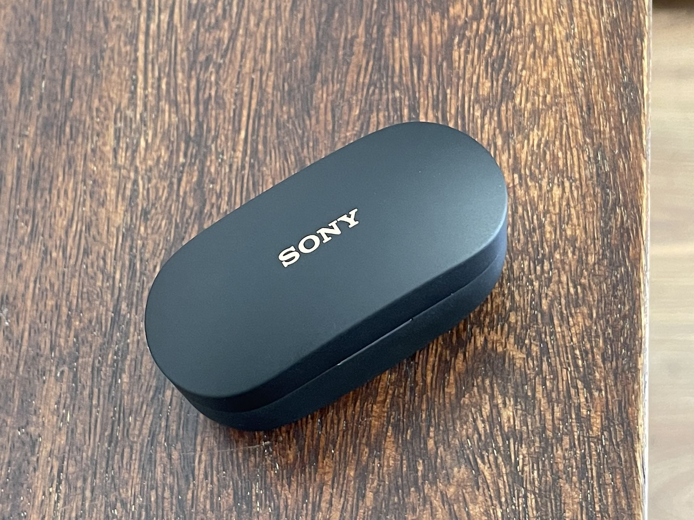

## Multipoint la loose
Allo Sony où es-tu ? En 2021 vous n'êtes pas capable de gérer sa sur vos petits écouteurs alors que sur vos wh1000xm4 pas de soucis ? (Ah oui vous voulez bien arrêter avec vos noms de produits à coucher dehors 🤡).

Ils s'appairent rapidement sous Windows pour Mac faudra passer par la case Bluetooth…

## Qualité audio quel plaisir
On met les Sony pour le son d’abord. Les AirPods sont les meilleurs en kit main libre mais les Sony sont faits pour transmettre l’émotion de la musique en priorité. 

C’est un avantage si vous privilégiez la qualité audio sur la musique mais en kit main libre il y’a un souffle désagréable 🤮. 

## Le boîtier 
Apple continue de nous mettre son port Lightning sur tous les accessoires audio et c’est fatiguant… avec les Sony place à l’usb c le port universel. 

Le boîtier est compatible avec la recharge sans fil qui a tendance à faire chauffer la batterie plus que ce qu’il faudrait pour une durée de vie écourtée. 

Une led vous indique l’état de charge du boîtier mais on ne sait pas exactement à quel pourcentage on se situe. Point de visualisation dans l’onglet batterie de iOS comme pour le boîtier des AirPods. 

Les écouteurs vous annoncent l’état de charge des écouteurs quand vous les mettez sur les oreilles. Je ne comprends pas l’utilité, il aurait été préférable d’annoncer l’état de charge du boîtier à la place. Le boîtier charge les écouteurs donc la plupart du temps ils sont à 100% une fois sortis. 

## Une application inégalée 
Je parle et je t’écoute, les écouteurs peuvent changer de mode automatiquement dès qu’ils détectent quelqu’un qui parle, ça c’est très pratique. 

Des raccourcis en veux-tu en voilà 🤩. Un reproche tout de même on ne peut pas configurer exactement ce qu’on souhaite faire. C’est comme un profil vous ne pouvez pas avoir une tap lecture deux tap volume haut trois tap volume bas c’est dommage. 
C’est dommage surtout que la limite est purement logicielle. 

En revanche j’ai été agréablement surpris 😮 du côté pratique de ces contrôles tactiles. En général on n’arrive pas à faire tout le temps ce qu’on veut mais Sony a bien dosé la sensibilité des contrôles. 

## Les ratés 

Tu te racles la gorges les écouteurs se mettent en mode écoute 👂. Pas très joyeux mais si tu te mets à chanter les écouteurs arrêtent l’annulation de bruit, les écouteurs sont trop bêtes sur ce mode donc je l’ai désactivé. 

Le bruit à chaque détection de mouvement pour le réglage adaptatif est déroutant. Quand vous vous baladez, à chaque transition marche 🚶‍♀️ arrêt 🛑 il y a un bruit. Au début vous vous demandez pourquoi. D’un point de vue utilisateur ce bruit ne sert strictement à rien je ne comprends pas qu’il soit activé par défaut.

Le bruit du vent même avec l’option annulation spécifique du vent 🌬 il n’est pas aussi réduit que les AirPods Pro. C'est un no go pour les coureurs 🏃‍♀️. 
Toujours d’un point de vue utilisateur je ne comprends pas pourquoi c’est une option, les écouteurs devraient être assez intelligents pour basculer sur ce mode tous seuls. 

J'ai remarqué le l'écouteur droit se décharge plus rapidement que le gauche de l'autre de 5 à 10% je trouve ça étonnant. C'est même étonnant de l'afficher à l'utilisateur autant afficher que le pourcentage le plus bas mais afficher le même pour les deux écouteurs. 

Enfin même si beaucoup de tests sur le net évoquent une stabilité à toute épreuve de la connexion Bluetooth de mon côté j’ai eu quelques ratés. A tour de rôle le gauche puis le droit se sont arrêtés sans raison. Quelques secondes plus tard ils se reconnectaient et ce même avec la dernière version logicielle. 

## En conclusion

Des écouteurs 🎧 très bon en musique très, voir trop paramétrables, l'utilisateur Lambda n'utilisera même pas la moitié des réglages disponibles dans l'application. En parlant d'application, l'utilisateur Lambda ne devrait pas avoir à modifier le niveau de la réduction de bruit, les écouteurs devraient être assez intelligent pour le faire. 

Le manque de connexion multi points est rédhibitoire et quand on possède un éco système Apple ils n'arrivent pas à la cheville des AirPods Pro en termes d'expérience utilisateur.