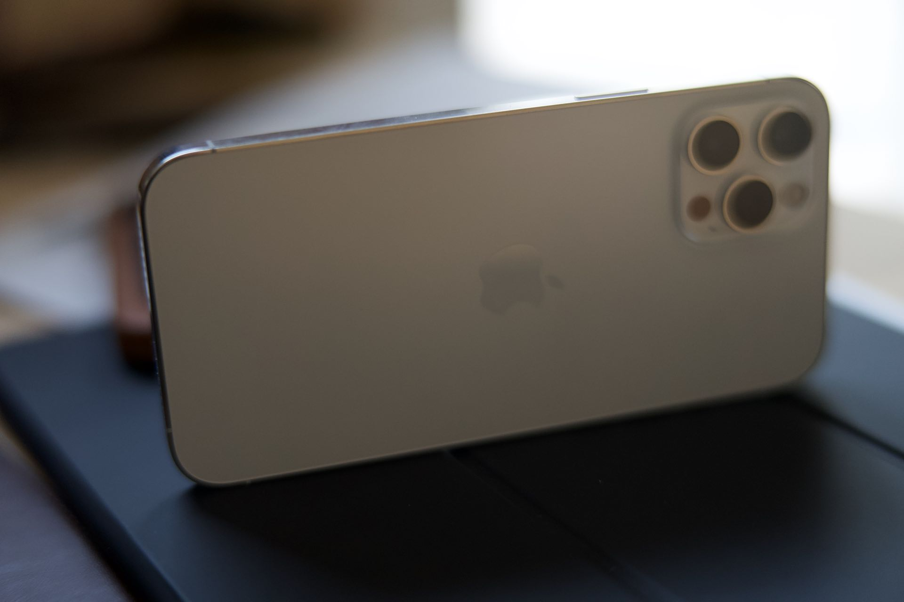
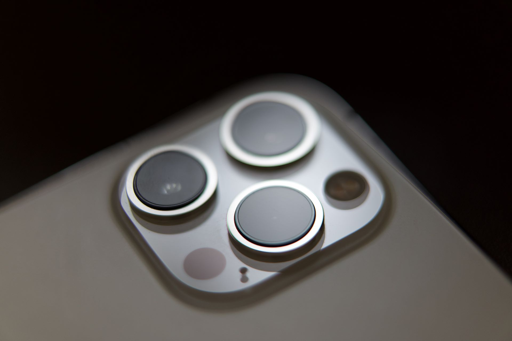

---
title: Défi de l’année 2021 prendre ses photos avec un iPhone 
description: Cette année je tente la comparaison des photos prises à l’iPhone et celles prises au Sony A7 III. On se revoit l’année prochaine pour le débrief.
tags:
- apple
- iphone

author: iSebmo
date: 2021-02-25
categories:
- photo

fimg: ""
--- 

Je tente un défi trop fou fou 🤣, je vais prendre la majorité des photos de l’année avec mon iPhone. J’ai l’habitude de faire un livre photo par année, jusqu’à présent les photos faites au mobile étaient minoritaires, cette année elles seront majoritaires ainsi, je pourrais comparer la différence de qualité.

## Pourquoi ? Mais t’es fou 🤪
Alors vous vous dites que le téléphone ne peut pas avoir la même qualité de photo qu’un appareil comme le Sony A7 ou même un [Leica Q](https://tfada.fr/passage-dun-a7r-%C3%A0-un-leica-q/). C’est totalement vrai, mais le meilleur appareil photo est celui qu’on a sur soi et j’ai malheureusement beaucoup  plus souvent mon téléphone à portée de main que mon appareil photo.

## Trois focales sinon rien
Je suis plutôt fan de la focale 50mm mais quand je pars j’aime bien pouvoir faire de la photo de paysage et avec cette focale c'est quand même pas pratique. L’iPhone possède 3 focales 13mm, 26mm et 65mm ce qui n’est pas rien. Prenez un trans standard par exemple vous aurez une focale de 24mm à 70mm, avec l’iPhone j’ai en plus un ultragrand angle toujours sur moi.

## Les photos immédiatement
Un énorme avantage de l’iPhone c’est que les photos sont dans notre bibliothèque immédiatement et sont prêtes à être modifiées et/ou partagées.
Avec un reflex il faut sortir la carte SD et importer les photos, les uploader sur le cloud et les partager. Certains y prennent sûrement plaisir et je ne critique pas. 

## Appliquer des filtres
Je m’essaie à la photo en noir et blanc, d’ailleurs en intérieur la qualité générale des photos au téléphone est déplorable. Donc, en intérieur je privilégie le noir et blanc. 

Avec l’iPhone j’ai la possibilité depuis la dernière version d’iOS 13 de pouvoir conserver le réglage de la couleur. Dès que je dégaine, le téléphone, le dernier filtre est appliqué. Le gros point positif c'est que même avec un filtre en noir et blanc je peux revenir à la couleur et cela sans shooter en RAW.
